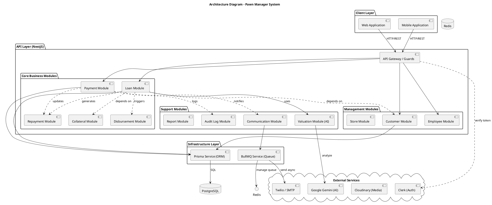

# Sơ đồ Kiến trúc Hệ thống (Architecture Diagram)

Tài liệu này mô tả kiến trúc phần mềm của hệ thống Pawn Manager. Hệ thống được xây dựng theo mô hình **Modular Monolith** trên nền tảng **NestJS**, giúp đảm bảo tính tổ chức code rõ ràng, dễ bảo trì nhưng vẫn giữ được sự đơn giản của một khối thống nhất (Monolith) trong việc triển khai.

## Mô tả Kiến trúc (Tiếng Việt)

Hệ thống được chia thành các tầng (layers) chính sau:

1.  **Presentation Layer (Tầng Giao diện/API)**:
    -   Là điểm tiếp nhận các yêu cầu HTTP từ Client.
    -   Sử dụng **Controllers** để định nghĩa các endpoints.
    -   Áp dụng các **Guards** (như `ClerkAuthGuard`) để xác thực và phân quyền.
    -   Sử dụng **Pipes** (như `ZodValidationPipe`) để kiểm tra dữ liệu đầu vào.
    -   Sử dụng **Interceptors** và **Filters** để xử lý logging và lỗi tập trung.

2.  **Application Layer (Tầng Ứng dụng/Modules)**:
    -   Chứa logic nghiệp vụ cốt lõi, được chia thành các Modules chức năng riêng biệt.
    -   **Core Business**: Quản lý khoản vay (`Loan`), Cầm cố (`Collateral`), Thanh toán (`Payment`), Giải ngân (`Disbursement`), Lịch trả nợ (`RepaymentSchedule`).
    -   **Management**: Quản lý Cửa hàng (`Store`), Nhân viên (`Employee`), Khách hàng (`Customer`).
    -   **Support**: Định giá AI (`Valuation`), Cấu hình (`Configurations`), Báo cáo (`Reports`).

3.  **Infrastructure Layer (Tầng Hạ tầng)**:
    -   Cung cấp các dịch vụ nền tảng cho ứng dụng.
    -   **Database Access**: Sử dụng **Prisma ORM** để tương tác với PostgreSQL.
    -   **Job Queue**: Sử dụng **BullMQ** và **Redis** để xử lý các tác vụ nền (gửi email, SMS, tính toán phức tạp).
    -   **Communication**: Module giao tiếp với Twilio (SMS) và SMTP (Email).

4.  **External Services (Dịch vụ Ngoài)**:
    -   Tích hợp với các bên thứ 3 như Clerk (Auth), Cloudinary (Media), Google Gemini (AI).

## Architecture Diagram (English)

