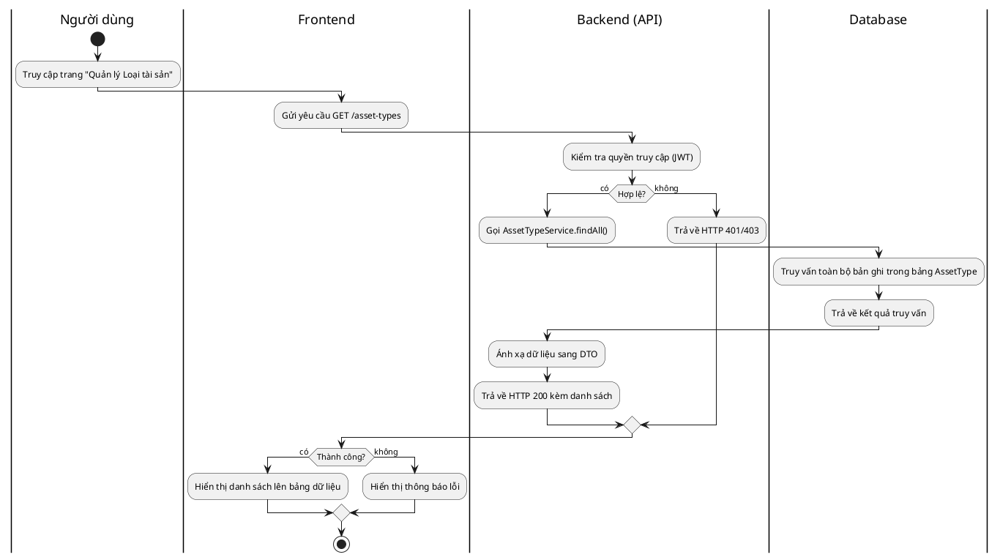
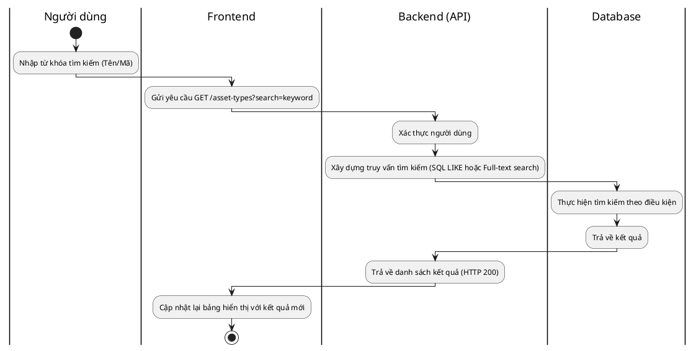
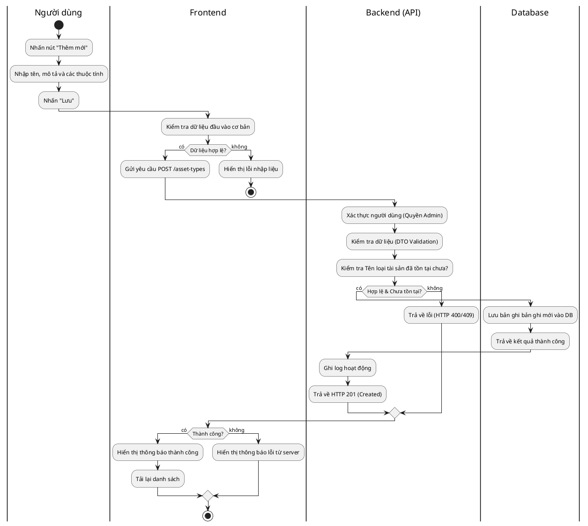
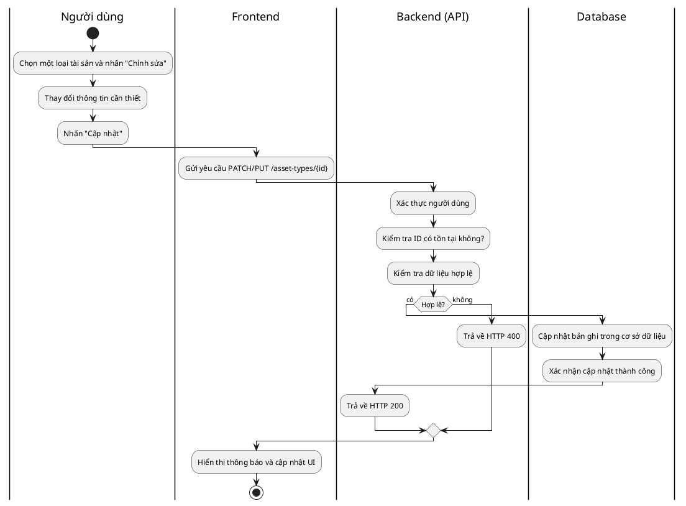
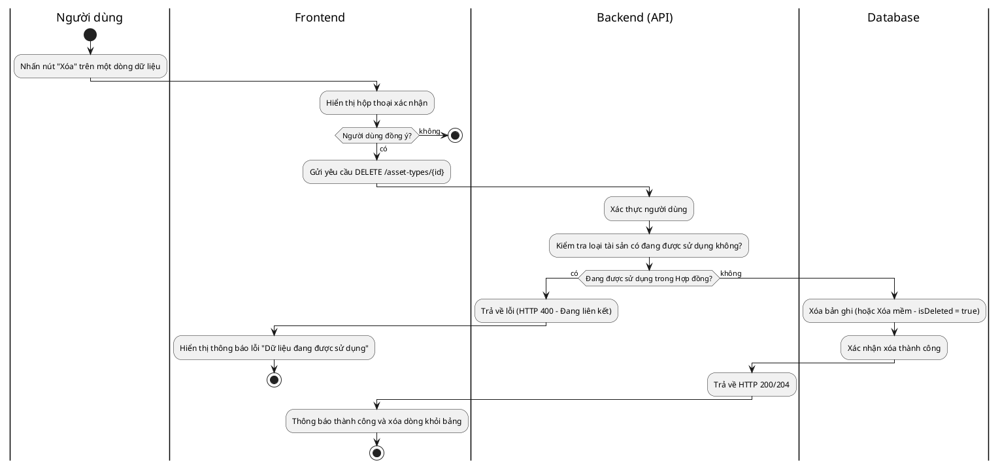

# Biểu đồ Hoạt động - Quản lý Loại tài sản (Asset Type Activity Diagrams)

Tài liệu này chi tiết các luồng xử lý từ đầu đến cuối (End-to-End) cho các thao tác CRUD đối với Loại tài sản.

---

## 1. Xem danh sách loại tài sản

**Giải thích luồng:**

1. Người dùng mở menu quản lý loại tài sản trên giao diện.
2. Frontend gửi yêu cầu lấy danh sách đến Backend.
3. Backend xác thực người dùng và truy vấn cơ sở dữ liệu.
4. Dữ liệu được trả về, Backend chuyển đổi sang định dạng phù hợp (DTO) và gửi lại cho Frontend.
5. Frontend hiển thị danh sách cho người dùng.

---

## 2. Tìm kiếm loại tài sản

**Giải thích luồng:**

1. Người dùng nhập thông tin vào ô tìm kiếm.
2. Hệ thống thực hiện tìm kiếm lọc ngay lập tức hoặc khi nhấn Enter.
3. Backend xử lý câu lệnh truy vấn có điều kiện lọc và trả về kết quả tương ứng.

---

## 3. Thêm loại tài sản mới

**Giải thích luồng:**

1. Người dùng điền form và nhấn lưu.
2. Backend kiểm tra tính nghiệp vụ (ví dụ: không cho phép trùng tên loại tài sản).
3. Sau khi lưu vào DB thành công, hệ thống ghi log và phản hồi cho người dùng.

---

## 4. Cập nhật thông tin loại tài sản

**Giải thích luồng:**

1. Tương tự như thêm mới, nhưng Backend cần kiểm tra sự tồn tại của ID trước khi cập nhật.
2. Chỉ những trường thay đổi mới được cập nhật (nếu dùng PATCH).

---

## 5. Xóa loại tài sản

**Giải thích luồng:**

1. Thao tác xóa thường yêu cầu xác nhận từ người dùng.
2. **Quan trọng:** Backend cần kiểm tra ràng buộc dữ liệu. Nếu loại tài sản này đang được dùng cho các tài sản thế chấp trong hệ thống, thường sẽ không cho phép xóa để đảm bảo toàn vẹn dữ liệu.
