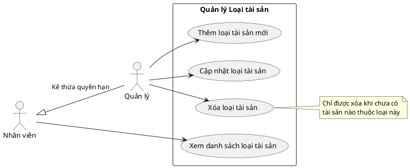

# Biểu đồ Use Case - Quản lý Loại tài sản (Asset Type CRUD)

Dưới đây là biểu đồ Use Case mô tả các tác vụ CRUD và quy trình nghiệp vụ cơ bản liên quan đến **Loại tài sản (Asset Type)** trong hệ thống, dựa trên API hiện có.

