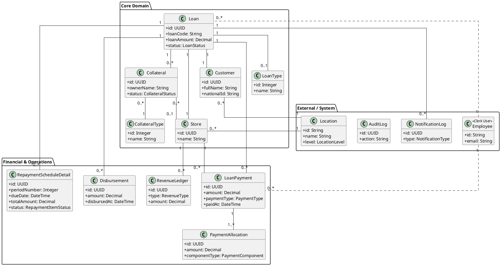
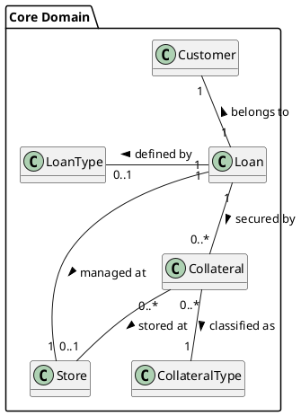
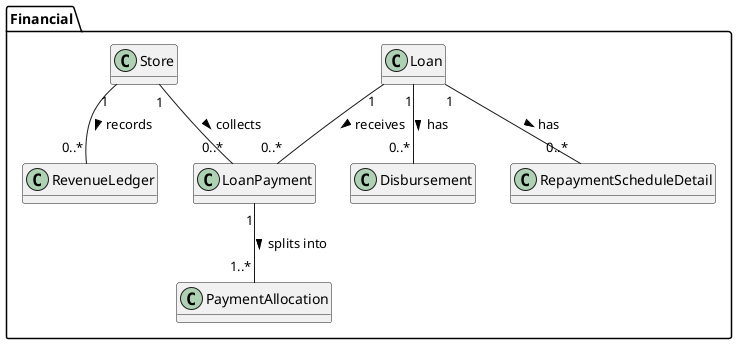
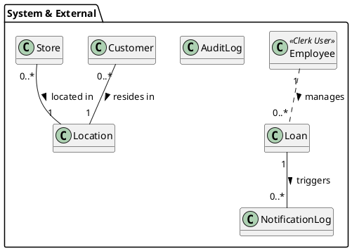

# Biểu đồ Lớp (Class Diagram) - Pawn Manager System

Tài liệu này mô tả chi tiết cấu trúc các lớp (Classes) và mối quan hệ giữa chúng trong hệ thống quản lý cầm đồ.

## Tổng quan (Overview)

Biểu đồ dưới đây cung cấp cái nhìn toàn cảnh về toàn bộ hệ thống.

## Chi tiết theo tên miền (Domain Details)

### 1. Core Domain (Nghiệp vụ lõi)

Bao gồm các thực thể chính để vận hành quy trình vay cầm cố: Khoản vay, Khách hàng, Tài sản và Cửa hàng.

| Thực thể nguồn (Source) | Quan hệ (Relationship) | Thực thể đích (Target) | Mô tả (Description) |
| :--- | :--- | :--- | :--- |
| **Loan** | 1 -- 1 | **Customer** | Mỗi khoản vay thuộc về duy nhất một khách hàng. |
| **Loan** | 1 -- 1 | **Store** | Khoản vay được quản lý tại một cửa hàng cụ thể. |
| **Loan** | 1 -- 0..* | **Collateral** | Một khoản vay được bảo đảm bởi một hoặc nhiều tài sản cầm cố. |
| **Loan** | 1 -- 0..1 | **LoanType** | Khoản vay tuân theo cấu hình lãi suất và kỳ hạn của một gói vay (Loan Type). |
| **Collateral** | 0..* -- 1 | **CollateralType** | Tài sản thuộc một loại cụ thể (ví dụ: Xe máy, Laptop) để tính phí giữ hộ. |
| **Collateral** | 0..* -- 0..1 | **Store** | Tài sản có thể được lưu kho tại cửa hàng (nếu đang cầm hoặc chờ thanh lý). |

### 2. Financial & Operations (Tài chính & Vận hành)

Quản lý dòng tiền, lịch trả nợ và ghi nhận doanh thu.

| Thực thể nguồn (Source) | Quan hệ (Relationship) | Thực thể đích (Target) | Mô tả (Description) |
| :--- | :--- | :--- | :--- |
| **Loan** | 1 -- 0..* | **RepaymentScheduleDetail** | Một khoản vay có nhiều kỳ trả nợ theo lịch (Lịch trả nợ). |
| **Loan** | 1 -- 0..* | **LoanPayment** | Một khoản vay có thể nhận nhiều lần thanh toán từ khách hàng. |
| **Loan** | 1 -- 0..* | **Disbursement** | Khoản vay có thể được giải ngân một hoặc nhiều lần (thường là 1 lần). |
| **LoanPayment** | 1 -- 1..* | **PaymentAllocation** | Số tiền một lần thanh toán được phân bổ chi tiết vào Gốc, Lãi, Phí, hoặc Phạt. |
| **Store** | 1 -- 0..* | **LoanPayment** | Cửa hàng là nơi thu tiền thanh toán của khách. |
| **Store** | 1 -- 0..* | **RevenueLedger** | Mọi khoản thu (Lãi, Phí) hoặc thanh lý tài sản đều được ghi nhận vào sổ cái doanh thu của cửa hàng. |

### 3. System & External (Hệ thống & Bên ngoài)

Các thực thể hỗ trợ quản lý người dùng, địa điểm và giám sát hệ thống.

| Thực thể nguồn (Source) | Quan hệ (Relationship) | Thực thể đích (Target) | Mô tả (Description) |
| :--- | :--- | :--- | :--- |
| **Customer** | 0..* -- 1 | **Location** | Khách hàng cư trú tại một Phường/Xã (Location) cụ thể. |
| **Store** | 0..* -- 1 | **Location** | Cửa hàng đặt tại một địa bàn Phường/Xã cụ thể. |
| **Loan** | 1 -- 0..* | **NotificationLog** | Các sự kiện của khoản vay (đến hạn, quá hạn) kích hoạt việc tạo nhật ký thông báo. |
| **Employee** | 1 .. 0..* | **Loan** | Nhân viên thực hiện các hành động trên khoản vay (Duyệt, Tạo, Từ chối) - Quan hệ logic qua ID. |
| **AuditLog** | N/A | **Entities** | Lưu vết thay đổi của các thực thể (Loan, Customer, v.v.) nhưng không có khóa ngoại cứng (Loose Coupling). |