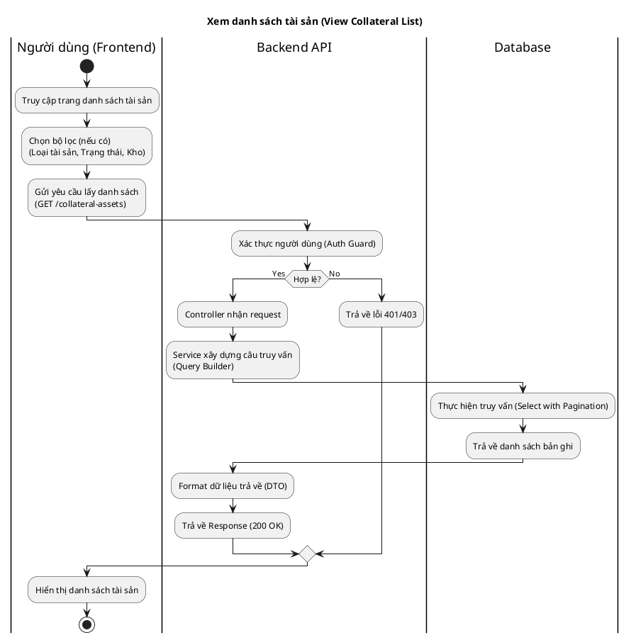
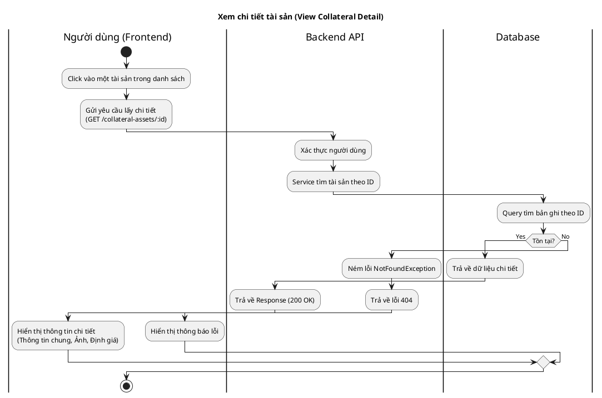
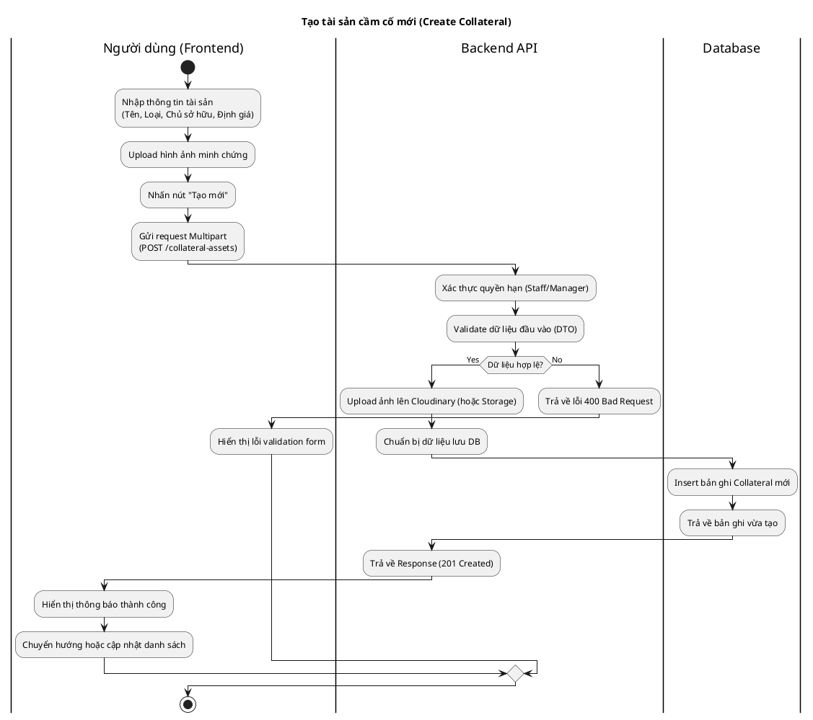
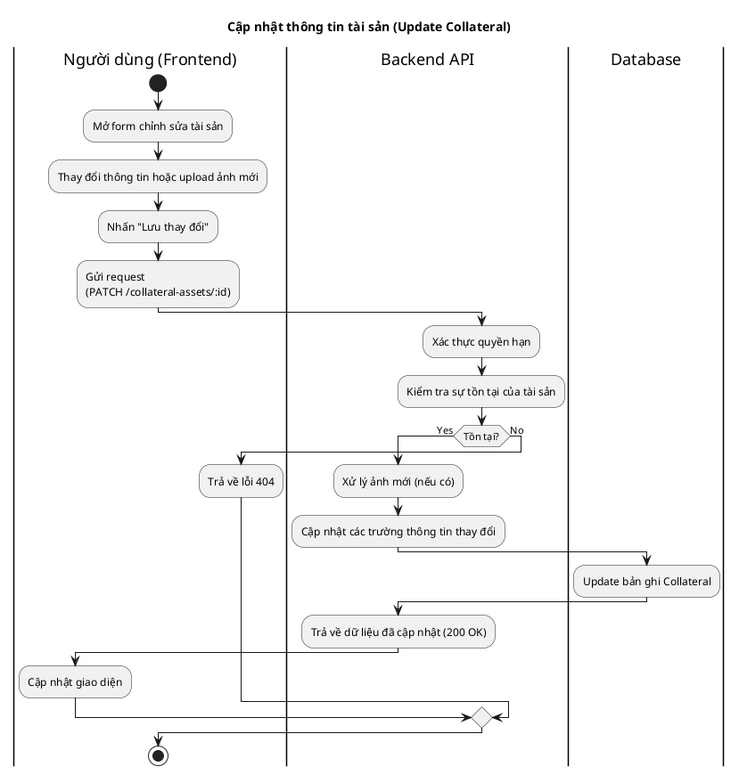
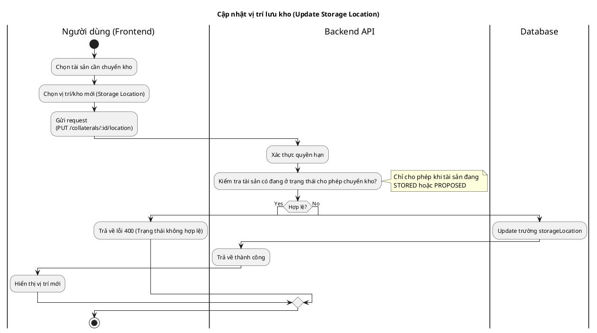
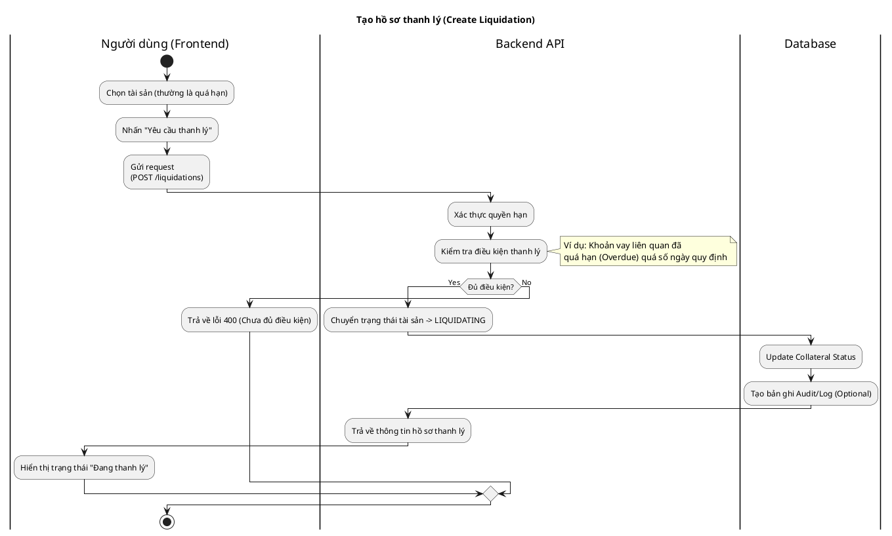
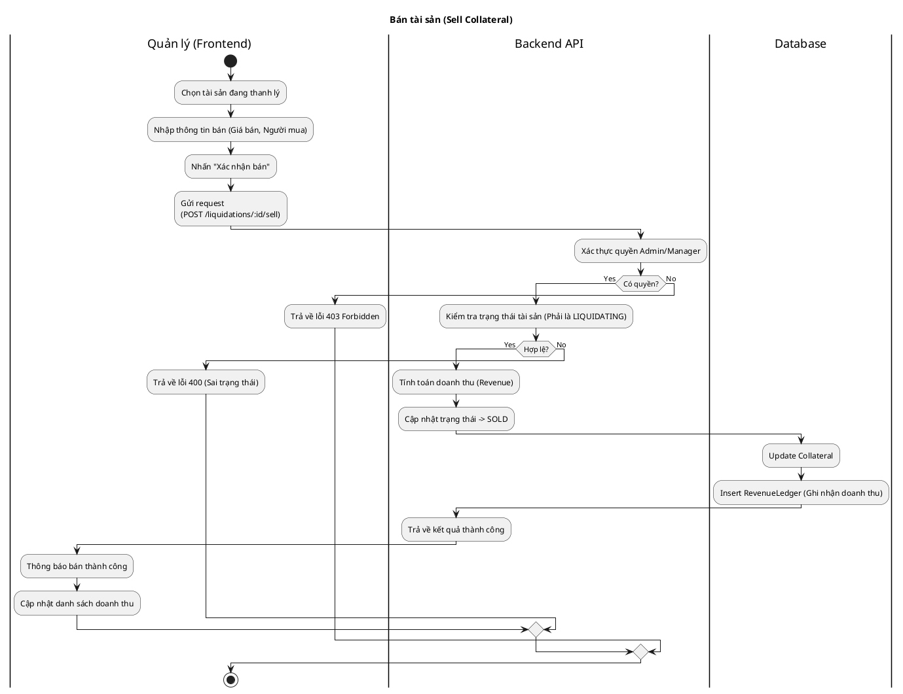

# Sơ đồ Hoạt động - Quản lý Tài sản Cầm cố (Collateral Asset Activity Diagrams)

Tài liệu này mô tả chi tiết luồng hoạt động (Activity Flow) từ End-to-End cho các chức năng quản lý tài sản cầm cố.

## 1. Xem danh sách tài sản (View List)



### Giải thích quy trình
1.  **Người dùng** truy cập vào giao diện quản lý tài sản trên Frontend và có thể áp dụng các bộ lọc tìm kiếm.
2.  **Frontend** gửi request API `GET` tới Backend.
3.  **Backend** kiểm tra quyền truy cập (Token hợp lệ, Role Staff/Manager).
4.  **Service** xử lý logic tìm kiếm và truy vấn **Database**.
5.  **Database** trả về kết quả.
6.  **Backend** phản hồi dữ liệu JSON chuẩn hóa cho Frontend để hiển thị.

---

## 2. Xem chi tiết tài sản (View Detail)



### Giải thích quy trình
1.  **Người dùng** chọn một tài sản cụ thể để xem.
2.  **Backend** nhận ID từ URL, truy vấn **Database**.
3.  Nếu tài sản tồn tại, trả về đầy đủ thông tin (bao gồm cả lịch sử định giá, hình ảnh).
4.  Nếu không tìm thấy, hệ thống báo lỗi 404.

---

## 3. Tạo tài sản cầm cố mới (Create Collateral)



### Giải thích quy trình
1.  **Người dùng** điền form tạo mới, bao gồm việc tải lên các hình ảnh thực tế của tài sản.
2.  **Backend** nhận dữ liệu dưới dạng `multipart/form-data`.
3.  Hệ thống xử lý upload ảnh (lưu vào Cloud storage hoặc Server disk) để lấy URL.
4.  Sau khi có URL ảnh và dữ liệu hợp lệ, **Backend** lưu thông tin tài sản vào **Database** với trạng thái mặc định (thường là `PROPOSED` hoặc `STORED`).
5.  Thông báo thành công được gửi về Frontend.

---

## 4. Cập nhật thông tin tài sản (Update Info)



### Giải thích quy trình
1.  Cho phép chỉnh sửa thông tin tài sản (trừ các trường cấm sửa đổi tùy nghiệp vụ).
2.  Tương tự như quy trình tạo mới, nhưng sử dụng phương thức `PATCH` để chỉ cập nhật các trường thay đổi.

---

## 5. Cập nhật vị trí lưu kho (Update Location)



### Giải thích quy trình
1.  Chức năng này dùng để quản lý kho bãi, cập nhật xem tài sản đang nằm ở kệ/kho nào.
2.  **Backend** cần kiểm tra trạng thái tài sản (ví dụ: Tài sản đã thanh lý hoặc đã trả khách thì không thể cập nhật vị trí kho).

---

## 6. Tạo hồ sơ thanh lý (Create Liquidation)



### Giải thích quy trình
1.  Nhân viên hoặc Quản lý đánh dấu một tài sản cần được thanh lý (do khách không trả nợ đúng hạn).
2.  Hệ thống kiểm tra các quy tắc nghiệp vụ (Business Rules) trước khi cho phép chuyển trạng thái sang `LIQUIDATING`.

---

## 7. Bán tài sản (Sell Collateral - Manager Only)



### Giải thích quy trình
1.  Đây là bước cuối cùng của quy trình thanh lý.
2.  **Chỉ Manager** mới có quyền thực hiện hành động này.
3.  **Backend** sẽ thực hiện nhiều tác vụ: cập nhật trạng thái tài sản thành `SOLD`, ghi nhận doanh thu vào bảng `RevenueLedger` để phục vụ báo cáo tài chính.

```