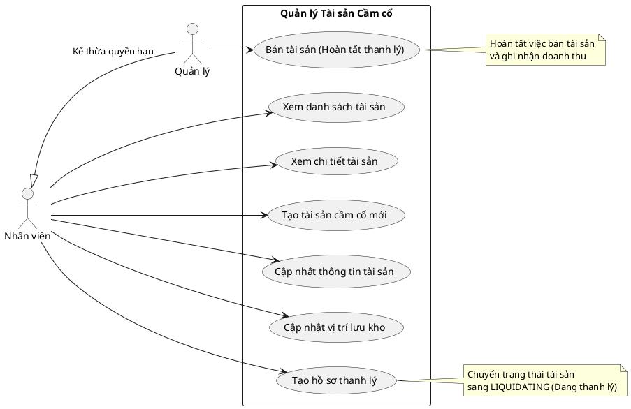

# Biểu đồ Use Case - Quản lý Tài sản Cầm cố (Collateral CRUD)

Dưới đây là biểu đồ Use Case mô tả các tác vụ CRUD và quy trình nghiệp vụ cơ bản liên quan đến **Tài sản Cầm cố (Collateral Asset)** trong hệ thống, dựa trên API hiện có.

