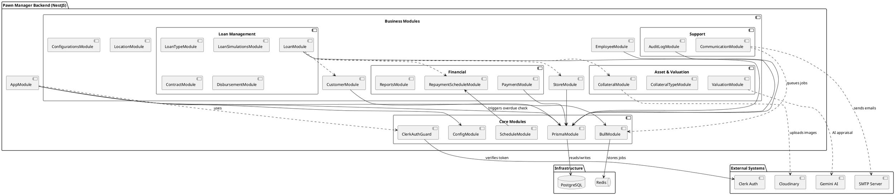

# Sơ đồ Thành phần (Component Diagram)

Sơ đồ dưới đây mô tả cấu trúc các thành phần (Components) chính của hệ thống Pawn Manager Backend và các mối quan hệ giữa chúng.

## Giải thích chi tiết (Vietnamese)

Hệ thống được xây dựng theo kiến trúc Modular của NestJS, chia tách rõ ràng giữa các thành phần nghiệp vụ và hạ tầng kỹ thuật.

### 1. External Systems (Hệ thống bên ngoài)
Các dịch vụ bên thứ ba mà hệ thống tích hợp:
*   **Clerk Auth**: Quản lý định danh, xác thực người dùng (Authentication).
*   **Cloudinary**: Lưu trữ hình ảnh (tài sản, giấy tờ khách hàng).
*   **Gemini AI**: Hỗ trợ định giá tài sản sơ bộ hoặc phân tích dữ liệu.
*   **SMTP Server**: Gửi email thông báo, nhắc nợ.

### 2. Infrastructure (Hạ tầng)
*   **PostgreSQL**: Cơ sở dữ liệu chính, lưu trữ toàn bộ dữ liệu nghiệp vụ.
*   **Redis**: Sử dụng cho hàng đợi (Message Queue) thông qua BullMQ để xử lý các tác vụ nền (background jobs) như gửi email, xử lý nhắc nợ.

### 3. Core Modules (Module lõi)
Các module cung cấp nền tảng kỹ thuật cho toàn bộ ứng dụng:
*   **PrismaModule**: Cung cấp layer kết nối Database (ORM).
*   **ConfigModule**: Quản lý biến môi trường (.env).
*   **BullModule**: Quản lý hàng đợi xử lý tác vụ bất đồng bộ.
*   **ClerkAuthGuard**: Guard bảo vệ các API endpoints, đảm bảo chỉ request có token hợp lệ từ Clerk mới được truy cập.

### 4. Business Modules (Module nghiệp vụ)
Được chia thành các nhóm chức năng chính:
*   **Loan Management**: Trung tâm của hệ thống, quản lý vòng đời khoản vay (`LoanModule`), cấu hình loại vay (`LoanTypeModule`), mô phỏng khoản vay (`LoanSimulationsModule`), hợp đồng (`ContractModule`) và giải ngân (`DisbursementModule`).
*   **Asset & Valuation**: Quản lý tài sản cầm cố (`CollateralModule`) và định giá (`ValuationModule`).
*   **Financial**: Xử lý thanh toán (`PaymentModule`), lịch trả nợ (`RepaymentScheduleModule`) và báo cáo tài chính (`ReportsModule`).
*   **Support**: Ghi nhật ký hệ thống (`AuditLogModule`) và quản lý giao tiếp khách hàng (`CommunicationModule`).
*   **General**: Quản lý nhân viên (`EmployeeModule`), khách hàng (`CustomerModule`), cửa hàng (`StoreModule`), và cấu hình hệ thống.

### Mối quan hệ chính
*   **LoanModule** đóng vai trò trung tâm, liên kết Customer, Collateral và Store để tạo nên một hồ sơ vay hoàn chỉnh.
*   **PrismaModule** được inject vào hầu hết các Service để thực hiện thao tác CRUD xuống Database.
*   **CommunicationModule** sử dụng **BullModule** để đẩy các tác vụ gửi email vào **Redis**, giúp hệ thống không bị block khi gửi số lượng lớn thông báo.
