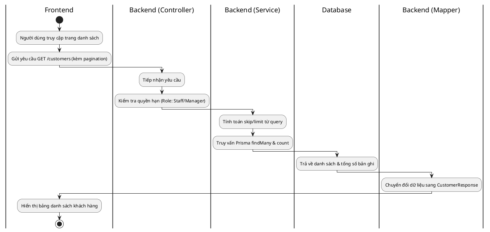
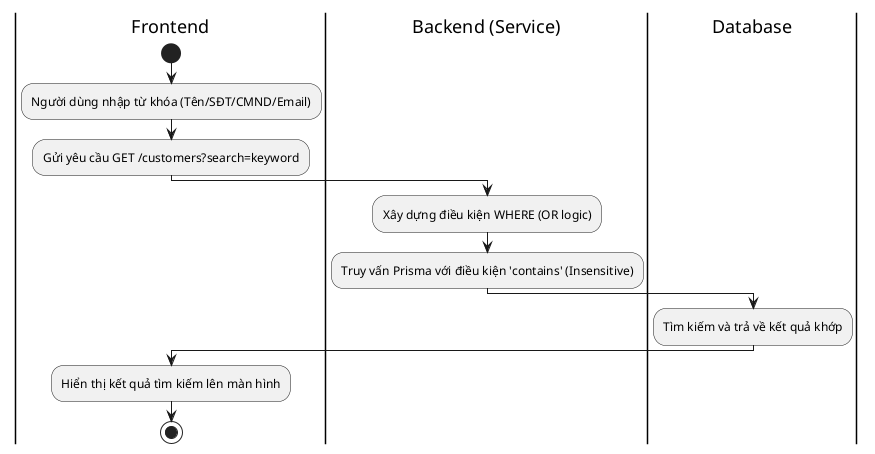
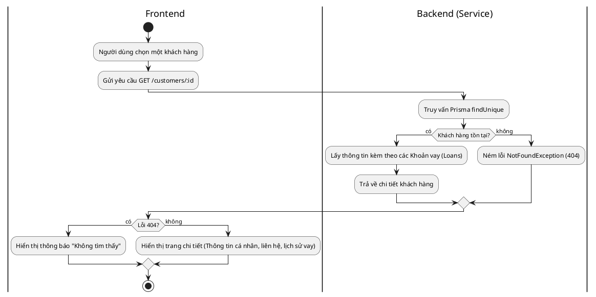
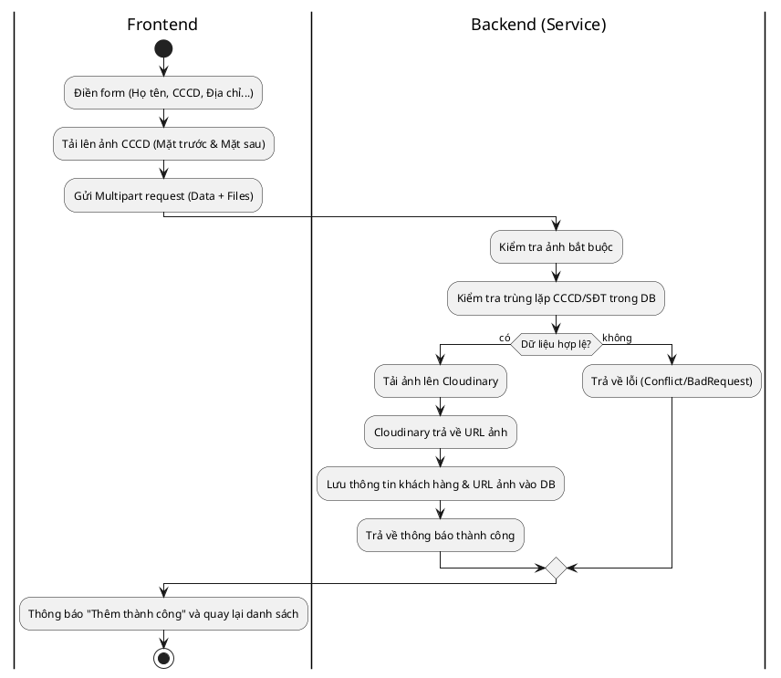
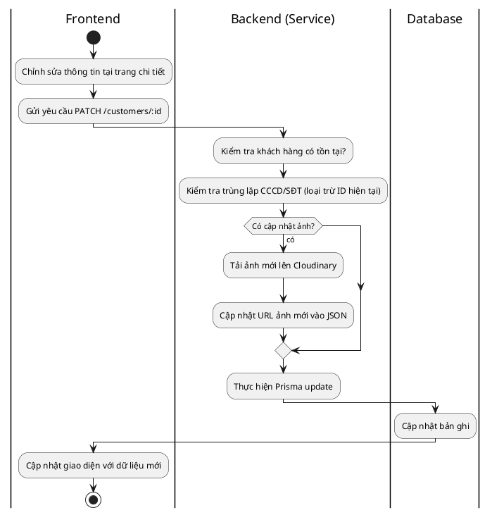
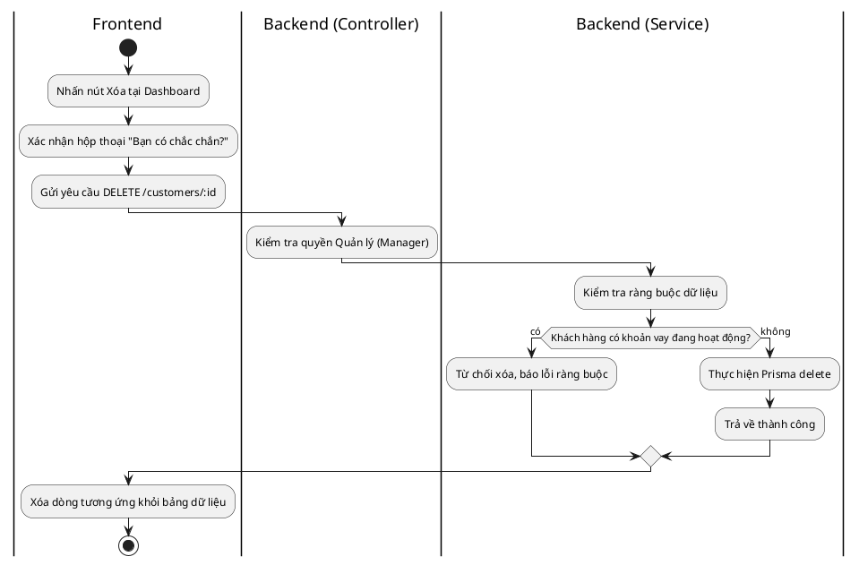

# Biểu đồ Hoạt động (Activity Diagrams) - Quản lý Khách hàng

Tài liệu này mô tả chi tiết quy trình nghiệp vụ từ đầu đến cuối (End-to-End) cho các hoạt động quản lý khách hàng.

---

## 1. Xem danh sách khách hàng (List Customers)

**Giải thích luồng:**

1. **Frontend:** Người dùng mở trang quản lý khách hàng, hệ thống tự động gửi yêu cầu lấy dữ liệu kèm theo tham số phân trang (ví dụ: trang 1, 20 bản ghi).
2. **Backend (Controller):** Kiểm tra xem người dùng có quyền Nhân viên hoặc Quản lý hay không.
3. **Backend (Service):** Xử lý logic phân trang và gọi database thông qua Prisma.
4. **Database:** Thực hiện truy vấn và trả về dữ liệu thô.
5. **Backend (Mapper):** Định dạng lại dữ liệu để ẩn các thông tin nhạy cảm hoặc không cần thiết trước khi gửi về Client.
6. **Frontend:** Nhận dữ liệu và hiển thị lên giao diện bảng.

---

## 2. Tìm kiếm khách hàng (Search Customers)

**Giải thích luồng:**

1. **Frontend:** Người dùng nhập từ khóa vào ô tìm kiếm. Yêu cầu được gửi lên kèm theo parameter `search`.
2. **Backend:** Hệ thống xây dựng câu truy vấn tìm kiếm không phân biệt hoa thường (`insensitive`) trên nhiều trường: Họ tên, Số điện thoại, CCCD và Email.
3. **Database:** Trả về các bản ghi thỏa mãn điều kiện.

---

## 3. Xem chi tiết khách hàng (View Details)

**Giải thích luồng:**

1. **Frontend:** Khi người dùng nhấn vào một dòng khách hàng, ID của khách hàng đó được gửi lên Backend.
2. **Backend:** Thực hiện tìm kiếm khách hàng theo ID duy nhất, đồng thời nạp thêm thông tin về địa chỉ (Ward/District/Province) và lịch sử các khoản vay. Nếu không tìm thấy, hệ thống sẽ trả về lỗi 404.
3. **Frontend:** Hiển thị toàn bộ thông tin chi tiết hoặc thông báo lỗi nếu có.

---

## 4. Thêm mới khách hàng (Create Customer)

**Giải thích luồng:**

1. **Frontend:** Người dùng điền đầy đủ thông tin và chọn file ảnh. Dữ liệu được gửi dưới dạng `form-data`.
2. **Backend:**
   - Kiểm tra xem file ảnh có được gửi kèm không.
   - Kiểm tra xem số CCCD hoặc SĐT đã tồn tại trong hệ thống chưa (tránh trùng lặp).
   - Tải ảnh lên dịch vụ lưu trữ đám mây Cloudinary.
   - Lưu toàn bộ thông tin (bao gồm URL ảnh từ Cloudinary) vào Database.
3. **Frontend:** Hiển thị thông báo kết quả cho người dùng.

---

## 5. Cập nhật thông tin khách hàng (Update Customer)

**Giải thích luồng:**

1. **Frontend:** Người dùng thay đổi thông tin trên giao diện. Các trường không đổi sẽ không được gửi lên hoặc gửi giữ nguyên.
2. **Backend:**
   - Xác minh khách hàng cần sửa có tồn tại không.
   - Kiểm tra xem thông tin mới (nếu có đổi CCCD/SĐT) có bị trùng với người khác không.
   - Nếu người dùng tải ảnh mới, hệ thống sẽ ghi đè ảnh cũ trên Cloudinary và cập nhật lại URL.
3. **Frontend:** Nhận phản hồi thành công và cập nhật lại màn hình.

---

## 6. Xóa khách hàng (Delete Customer)

**Giải thích luồng:**

1. **Frontend:** Chỉ người dùng có quyền Quản lý mới thấy nút xóa. Sau khi xác nhận, yêu cầu xóa được gửi đi.
2. **Backend:**
   - Chỉ cho phép `Role.MANAGER` thực hiện.
   - **Quan trọng:** Kiểm tra khách hàng đó có đang nợ hoặc có hợp đồng nào đang chạy không. Nếu có, tuyệt đối không cho phép xóa để giữ toàn vẹn dữ liệu tài chính.
   - Nếu đủ điều kiện, thực hiện xóa bản ghi khỏi Database.
3. **Frontend:** Cập nhật lại danh sách, ẩn khách hàng vừa xóa.
