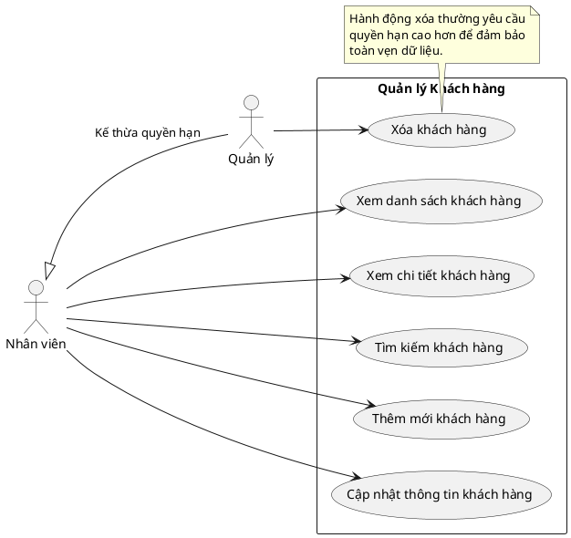

# Biểu đồ Use Case - Quản lý Khách hàng (Customer CRUD)

Dưới đây là biểu đồ Use Case mô tả các tác vụ CRUD và quản lý thông tin **Khách hàng (Customer)** trong hệ thống.

```plantuml
@startuml
left to right direction
skinparam packageStyle rectangle

actor "Nhân viên" as Employee
actor "Quản lý" as Manager

package "Quản lý Khách hàng" {
    usecase "Xem danh sách khách hàng" as UC_List
    usecase "Xem chi tiết khách hàng" as UC_Detail
    usecase "Tìm kiếm khách hàng" as UC_Search
    usecase "Thêm mới khách hàng" as UC_Create
    usecase "Cập nhật thông tin khách hàng" as UC_Update
    usecase "Xóa khách hàng" as UC_Delete
}

' Quan hệ giữa các actor
Employee <|-- Manager : Kế thừa quyền hạn

' Nhân viên có thể thực hiện hầu hết các tác vụ CRUD cơ bản
Employee --> UC_List
Employee --> UC_Detail
Employee --> UC_Search
Employee --> UC_Create
Employee --> UC_Update

' Quản lý có thêm quyền xóa khách hàng
Manager --> UC_Delete

note bottom of UC_Delete
  Hành động xóa thường yêu cầu
  quyền hạn cao hơn để đảm bảo
  toàn vẹn dữ liệu.
end note

@enduml
```
