# Database Schema (ERD)

This document contains the Entity Relationship Diagram (ERD) and detailed specifications for each entity.

## Overview ERD

The following diagram illustrates the relationships between all entities in the system.

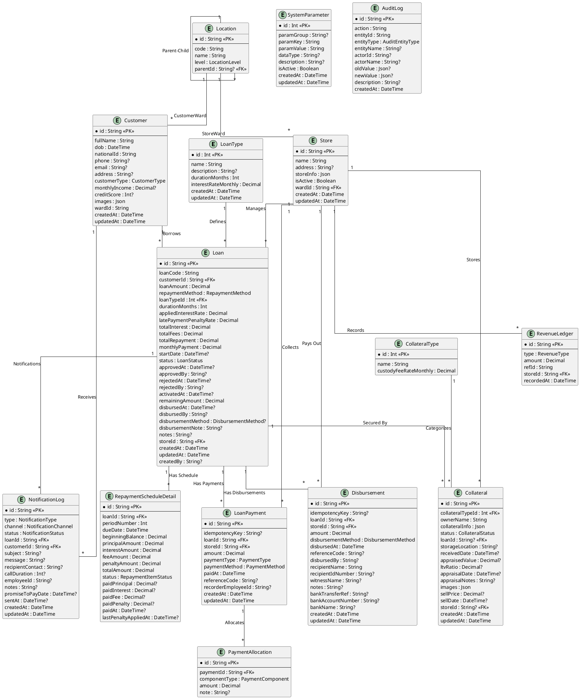

## Entity Specifications

Detailed descriptions for each entity.

### 1. Loan Product Type

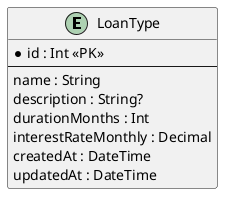

| Field | Type | Description |
| :--- | :--- | :--- |
| id | Int | ID (Khóa chính tự tăng) |
| name | String | Tên gói vay (Duy nhất) |
| description | String? | Mô tả chi tiết gói vay |
| durationMonths | Int | Thời hạn vay mặc định (tháng) |
| interestRateMonthly | Decimal | Lãi suất hàng tháng (%) |
| createdAt | DateTime | Ngày tạo |
| updatedAt | DateTime | Ngày cập nhật gần nhất |

### 2. Customer

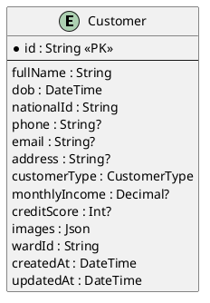

| Field | Type | Description |
| :--- | :--- | :--- |
| id | String | ID Khách hàng (UUID) |
| fullName | String | Họ và tên |
| dob | DateTime | Ngày sinh |
| nationalId | String | CCCD/CMND (Duy nhất) |
| phone | String? | Số điện thoại |
| email | String? | Email liên hệ |
| address | String? | Địa chỉ thường trú |
| customerType | Enum | Loại khách hàng (VIP/Thường) |
| monthlyIncome | Decimal? | Thu nhập hàng tháng |
| creditScore | Int? | Điểm tín dụng nội bộ |
| images | Json | Danh sách ảnh hồ sơ (CCCD, chân dung) |
| wardId | String | ID Phường/Xã cư trú |
| createdAt | DateTime | Ngày tạo hồ sơ |
| updatedAt | DateTime | Ngày cập nhật hồ sơ |

### 3. Loan

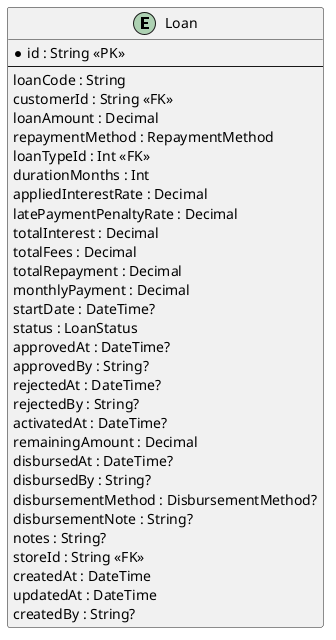

| Field | Type | Description |
| :--- | :--- | :--- |
| id | String | ID Hợp đồng vay (UUID) |
| loanCode | String | Mã hợp đồng vay (Duy nhất) |
| customerId | String | ID Khách hàng vay |
| loanAmount | Decimal | Số tiền vay gốc |
| repaymentMethod | Enum | Phương thức trả nợ (Góp đều/Lãi trước) |
| loanTypeId | Int | Loại sản phẩm vay |
| durationMonths | Int | Thời hạn vay (Snapshot) |
| appliedInterestRate | Decimal | Lãi suất áp dụng (Snapshot) |
| latePaymentPenaltyRate | Decimal | Phí phạt quá hạn (Snapshot) |
| totalInterest | Decimal | Tổng lãi dự kiến |
| totalFees | Decimal | Tổng phí dịch vụ |
| totalRepayment | Decimal | Tổng tiền phải trả (Gốc + Lãi + Phí) |
| monthlyPayment | Decimal | Số tiền phải trả hàng tháng |
| startDate | DateTime? | Ngày bắt đầu tính lãi |
| status | Enum | Trạng thái hợp đồng |
| approvedAt | DateTime? | Thời điểm duyệt |
| approvedBy | String? | Người duyệt |
| rejectedAt | DateTime? | Thời điểm từ chối |
| rejectedBy | String? | Người từ chối |
| activatedAt | DateTime? | Thời điểm kích hoạt |
| remainingAmount | Decimal | Dư nợ gốc còn lại |
| disbursedAt | DateTime? | Thời điểm giải ngân |
| disbursedBy | String? | Người thực hiện giải ngân |
| disbursementMethod | Enum | Phương thức giải ngân |
| disbursementNote | String? | Ghi chú giải ngân |
| notes | String? | Ghi chú chung |
| storeId | String | ID Cửa hàng quản lý |
| createdAt | DateTime | Ngày tạo đơn vay |
| updatedAt | DateTime | Ngày cập nhật đơn vay |
| createdBy | String? | Người tạo đơn |

### 4. Repayment Schedule

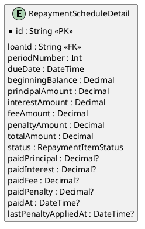

| Field | Type | Description |
| :--- | :--- | :--- |
| id | String | ID Chi tiết lịch trả nợ |
| loanId | String | ID Hợp đồng vay |
| periodNumber | Int | Kỳ trả nợ số (1, 2, 3...) |
| dueDate | DateTime | Ngày đến hạn thanh toán |
| beginningBalance | Decimal | Dư nợ đầu kỳ |
| principalAmount | Decimal | Tiền gốc phải trả kỳ này |
| interestAmount | Decimal | Tiền lãi phải trả kỳ này |
| feeAmount | Decimal | Phí quản lý/lưu kho kỳ này |
| penaltyAmount | Decimal | Tiền phạt chậm trả (nếu có) |
| totalAmount | Decimal | Tổng cộng phải trả kỳ này |
| status | Enum | Trạng thái (Chờ, Đã trả, Quá hạn) |
| paidPrincipal | Decimal? | Gốc đã trả thực tế |
| paidInterest | Decimal? | Lãi đã trả thực tế |
| paidFee | Decimal? | Phí đã trả thực tế |
| paidPenalty | Decimal? | Phạt đã trả thực tế |
| paidAt | DateTime? | Ngày thanh toán thực tế |
| lastPenaltyAppliedAt | DateTime? | Ngày tính phạt gần nhất |

### 5. Payments

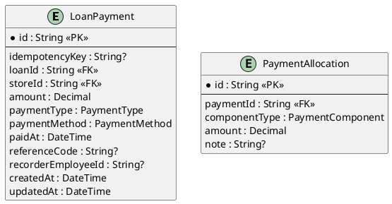

**LoanPayment**
| Field | Type | Description |
| :--- | :--- | :--- |
| id | String | ID Giao dịch thanh toán |
| idempotencyKey | String? | Khóa chống trùng lặp |
| loanId | String | ID Hợp đồng vay |
| storeId | String | ID Cửa hàng thu tiền |
| amount | Decimal | Số tiền khách đóng |
| paymentType | Enum | Loại thanh toán (Định kỳ/Tất toán...) |
| paymentMethod | Enum | Phương thức (Tiền mặt/CK) |
| paidAt | DateTime | Thời điểm thanh toán |
| referenceCode | String? | Mã tham chiếu/Mã hóa đơn |
| recorderEmployeeId | String? | ID Nhân viên thu tiền |
| createdAt | DateTime | Ngày tạo bản ghi |
| updatedAt | DateTime | Ngày cập nhật bản ghi |

**PaymentAllocation**
| Field | Type | Description |
| :--- | :--- | :--- |
| id | String | ID Phân bổ thanh toán |
| paymentId | String | ID Giao dịch thanh toán gốc |
| componentType | Enum | Loại thành phần (Gốc/Lãi/Phí/Phạt) |
| amount | Decimal | Số tiền phân bổ cho thành phần này |
| note | String? | Ghi chú phân bổ |

### 6. Disbursement

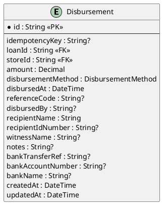

| Field | Type | Description |
| :--- | :--- | :--- |
| id | String | ID Giao dịch giải ngân |
| loanId | String | ID Hợp đồng vay |
| storeId | String | ID Cửa hàng thực hiện |
| amount | Decimal | Số tiền giải ngân |
| disbursementMethod | Enum | Phương thức (Tiền mặt/CK) |
| disbursedAt | DateTime | Thời điểm giải ngân |
| referenceCode | String? | Mã phiếu chi |
| disbursedBy | String? | ID Nhân viên chi tiền |
| recipientName | String | Tên người nhận tiền |
| recipientIdNumber | String? | CMND/CCCD người nhận |
| witnessName | String? | Tên người làm chứng |
| notes | String? | Ghi chú |
| bankTransferRef | String? | Mã giao dịch ngân hàng |
| bankAccountNumber | String? | Số tài khoản nhận |
| bankName | String? | Tên ngân hàng nhận |

### 7. Collateral & Store

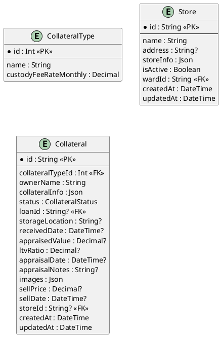

**CollateralType**
| Field | Type | Description |
| :--- | :--- | :--- |
| id | Int | ID Loại tài sản |
| name | String | Tên loại tài sản (Xe máy, Laptop...) |
| custodyFeeRateMonthly | Decimal | Phí giữ hộ hàng tháng (%) |

**Store**
| Field | Type | Description |
| :--- | :--- | :--- |
| id | String | ID Cửa hàng |
| name | String | Tên cửa hàng |
| address | String? | Địa chỉ cụ thể |
| storeInfo | Json | Thông tin bổ sung |
| isActive | Boolean | Trạng thái hoạt động |
| wardId | String | ID Phường/Xã |
| createdAt | DateTime | Ngày tạo |
| updatedAt | DateTime | Ngày cập nhật |

**Collateral**
| Field | Type | Description |
| :--- | :--- | :--- |
| id | String | ID Tài sản |
| collateralTypeId | Int | Loại tài sản |
| ownerName | String | Tên chủ sở hữu |
| collateralInfo | Json | Thông tin chi tiết (Model, Serial...) |
| status | Enum | Trạng thái tài sản |
| loanId | String? | ID Hợp đồng vay (nếu đã cầm) |
| storageLocation | String? | Vị trí lưu kho |
| receivedDate | DateTime? | Ngày nhận tài sản |
| appraisedValue | Decimal? | Giá trị định giá |
| ltvRatio | Decimal? | Tỷ lệ vay trên giá trị (%) |
| appraisalDate | DateTime? | Ngày định giá |
| appraisalNotes | String? | Ghi chú định giá |
| images | Json | Ảnh tài sản |
| sellPrice | Decimal? | Giá bán thanh lý |
| sellDate | DateTime? | Ngày bán thanh lý |
| storeId | String? | ID Cửa hàng quản lý |

### 8. System & Audit

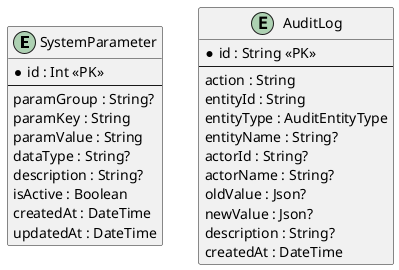

**SystemParameter**
| Field | Type | Description |
| :--- | :--- | :--- |
| id | Int | ID Tham số |
| paramGroup | String? | Nhóm tham số |
| paramKey | String | Mã tham số (Key) |
| paramValue | String | Giá trị tham số |
| dataType | String? | Kiểu dữ liệu (STRING, NUMBER...) |
| description | String? | Mô tả ý nghĩa |
| isActive | Boolean | Trạng thái kích hoạt |

**AuditLog**
| Field | Type | Description |
| :--- | :--- | :--- |
| id | String | ID Nhật ký |
| action | String | Hành động thực hiện |
| entityId | String | ID Đối tượng bị tác động |
| entityType | Enum | Loại đối tượng |
| entityName | String? | Tên đối tượng |
| actorId | String? | ID Người thực hiện |
| actorName | String? | Tên người thực hiện |
| oldValue | Json? | Dữ liệu cũ |
| newValue | Json? | Dữ liệu mới |
| description | String? | Mô tả chi tiết hành động |
| createdAt | DateTime | Thời điểm ghi nhật ký |

### 9. Revenue & Location

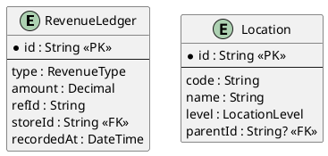

**RevenueLedger**
| Field | Type | Description |
| :--- | :--- | :--- |
| id | String | ID Sổ cái doanh thu |
| type | Enum | Loại doanh thu (Lãi/Phí/Thanh lý) |
| amount | Decimal | Số tiền |
| refId | String | ID Tham chiếu (Loan/Payment) |
| storeId | String | ID Cửa hàng |
| recordedAt | DateTime | Thời điểm ghi nhận |

**Location**
| Field | Type | Description |
| :--- | :--- | :--- |
| id | String | ID Địa danh |
| code | String | Mã địa danh |
| name | String | Tên địa danh (Tỉnh/Huyện/Xã) |
| level | Enum | Cấp hành chính |
| parentId | String? | ID Đơn vị cấp trên |

### 10. Notification Log

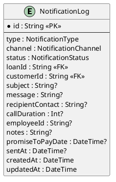

| Field | Type | Description |
| :--- | :--- | :--- |
| id | String | ID Nhật ký thông báo |
| type | Enum | Loại thông báo |
| channel | Enum | Kênh gửi (SMS/Email/Call) |
| status | Enum | Trạng thái gửi |
| loanId | String | ID Khoản vay liên quan |
| customerId | String | ID Khách hàng nhận |
| subject | String? | Tiêu đề |
| message | String? | Nội dung tin nhắn |
| recipientContact | String? | Số điện thoại/Email nhận |
| callDuration | Int? | Thời lượng gọi (giây) |
| employeeId | String? | ID Nhân viên gọi điện |
| notes | String? | Ghi chú kết quả |
| promiseToPayDate | DateTime? | Ngày hứa trả nợ |
| sentAt | DateTime? | Thời điểm gửi thành công |
