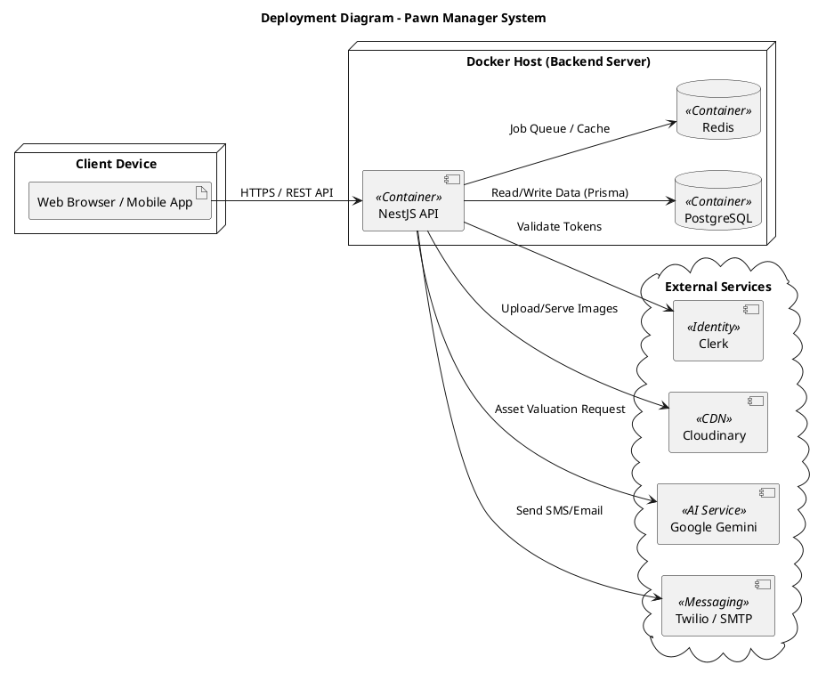

# Sơ đồ Triển khai (Deployment Diagram)

Tài liệu này mô tả kiến trúc triển khai vật lý của hệ thống Pawn Manager, bao gồm các thành phần phần cứng, phần mềm, container và các dịch vụ bên thứ ba được tích hợp.

## Mô tả (Tiếng Việt)

Hệ thống được thiết kế theo kiến trúc Microservices (hoặc Modular Monolith) chạy trên nền tảng container (Docker).

1.  **Client Device (Thiết bị người dùng)**:
    -   Người dùng (Quản lý, Nhân viên) truy cập hệ thống thông qua trình duyệt web hoặc ứng dụng di động.
    -   Giao tiếp với Backend thông qua giao thức HTTPS (REST API).

2.  **Backend Server (Máy chủ ứng dụng)**:
    -   Được triển khai trên môi trường Docker Host.
    -   **NestJS API Container**: Chứa logic xử lý chính của ứng dụng, chạy trên Node.js runtime.
    -   **PostgreSQL Container**: Cơ sở dữ liệu quan hệ lưu trữ thông tin hợp đồng, khách hàng, giao dịch...
    -   **Redis Container**: Dùng để quản lý hàng đợi tác vụ (Queue) cho việc gửi thông báo, xử lý background jobs và caching.

3.  **External Services (Dịch vụ bên thứ ba)**:
    -   **Clerk**: Quản lý xác thực và phân quyền người dùng (Identity Provider).
    -   **Cloudinary**: Lưu trữ và quản lý hình ảnh tài sản cầm cố.
    -   **Google Gemini AI**: Hỗ trợ định giá tài sản và phân tích dữ liệu thông minh.
    -   **Twilio / SMTP**: Dịch vụ gửi tin nhắn SMS và Email thông báo nhắc nợ, giao dịch thành công.

## Diagram (English)

