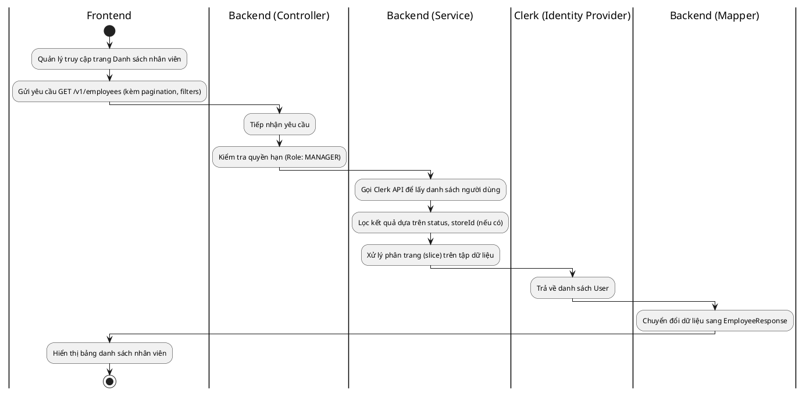
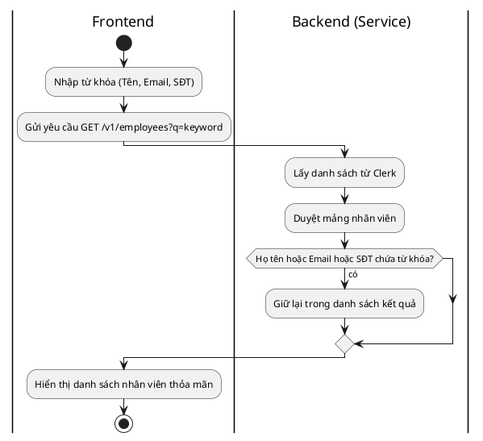
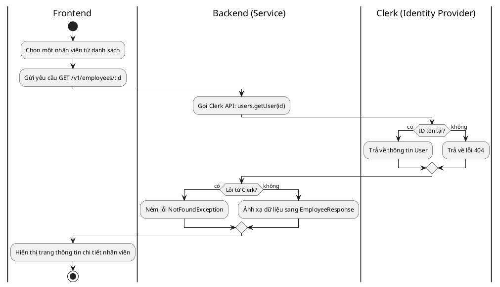
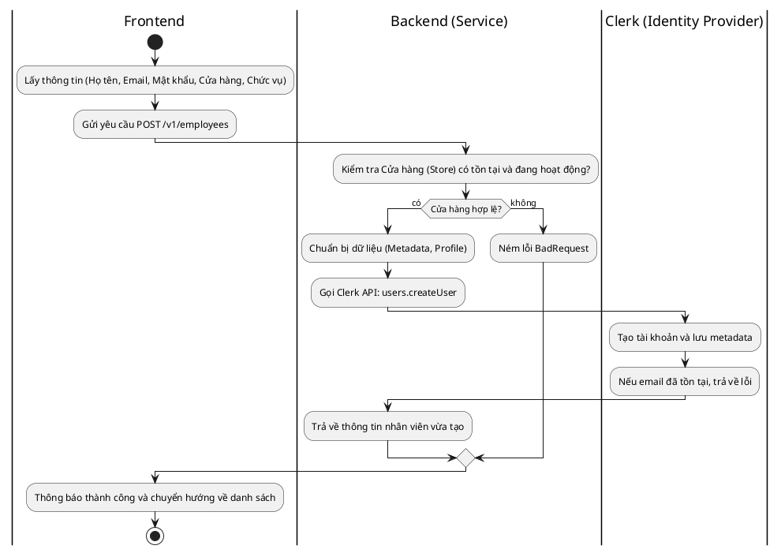
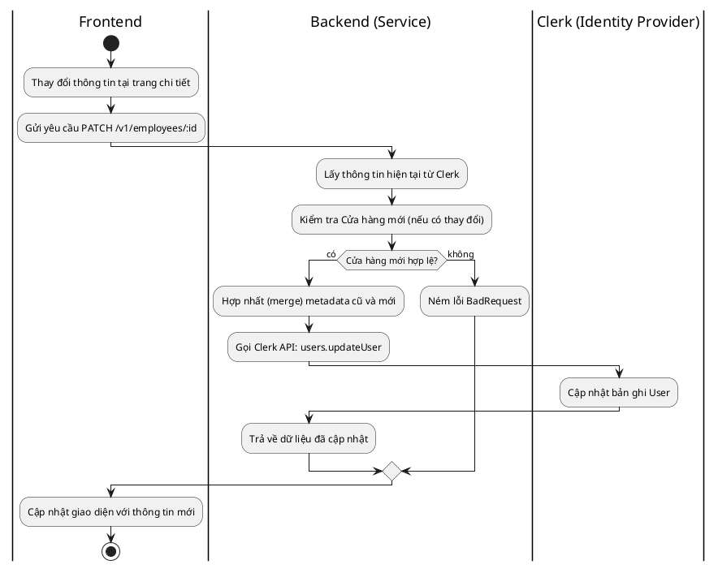
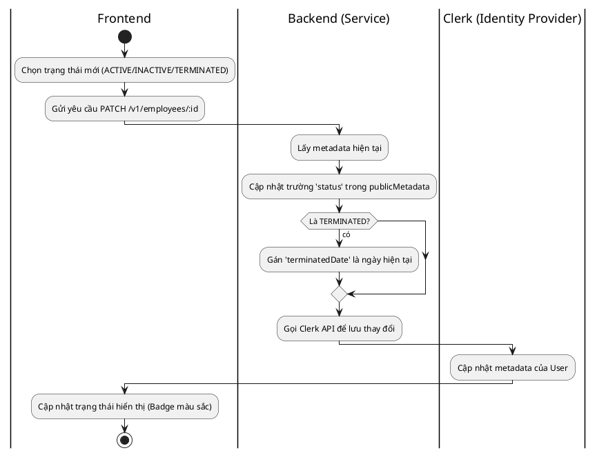

# Biểu đồ Hoạt động (Activity Diagrams) - Quản lý Nhân viên

Tài liệu này mô tả chi tiết quy trình nghiệp vụ từ đầu đến cuối (End-to-End) cho các hoạt động quản lý nhân viên trong hệ thống, bao gồm cả tương tác Frontend, Backend và dịch vụ bên thứ ba (Clerk).

---

## 1. Xem danh sách nhân viên (List Employees)

**Giải thích luồng:**

1. **Frontend:** Khi người quản lý mở trang nhân viên, ứng dụng gửi yêu cầu lấy danh sách kèm theo các tham số như trang, số lượng bản ghi và bộ lọc (cửa hàng, trạng thái).
2. **Backend:** Hệ thống xác thực quyền `MANAGER`. Vì dữ liệu nhân viên được quản lý qua **Clerk**, Service sẽ gọi API của Clerk để lấy toàn bộ danh sách.
3. **Logic xử lý:** Do Clerk cung cấp danh sách thô, Backend thực hiện lọc (Filter) theo cửa hàng, trạng thái và thực hiện phân trang thủ công trên mảng kết quả.
4. **Kết quả:** Dữ liệu được ánh xạ qua Mapper để chuẩn hóa định dạng và gửi về Frontend để hiển thị.

---

## 2. Tìm kiếm nhân viên (Search Employees)

**Giải thích luồng:**

1. **Frontend:** Người dùng nhập từ khóa tìm kiếm vào ô nhập liệu.
2. **Backend:** Hệ thống lấy dữ liệu từ Clerk, sau đó thực hiện tìm kiếm trên bộ nhớ (In-memory search).
3. **Tiêu chí:** So sánh từ khóa (không phân biệt hoa thường) với Họ tên đầy đủ, Email và Số điện thoại lưu trong `publicMetadata`.
4. **Kết quả:** Trả về danh sách đã lọc cho người dùng.

---

## 3. Xem chi tiết nhân viên (View Details)

**Giải thích luồng:**

1. **Frontend:** Người dùng nhấn vào một nhân viên để xem chi tiết.
2. **Backend:** Truy vấn trực tiếp đến Clerk bằng ID nhân viên.
3. **Xử lý lỗi:** Nếu Clerk không tìm thấy User hoặc ID không hợp lệ, Backend sẽ chuyển đổi thành mã lỗi tương ứng (404 hoặc 400).
4. **Hiển thị:** Dữ liệu chi tiết bao gồm thông tin cơ bản, metadata về cửa hàng, ngày vào làm và phân quyền được hiển thị rõ ràng.

---

## 4. Thêm mới nhân viên (Create Employee)

**Giải thích luồng:**

1. **Frontend:** Quản lý điền form tạo nhân viên mới.
2. **Backend:**
   - Kiểm tra xem cửa hàng được gán cho nhân viên có đang hoạt động (Active) hay không để đảm bảo logic nghiệp vụ.
   - Gửi yêu cầu tạo User sang Clerk. Thông tin về cửa hàng (`storeId`, `storeName`) được lưu vào `publicMetadata`, còn chức vụ (`role`) được lưu vào `privateMetadata` để bảo mật.
3. **Kết quả:** Nếu thành công (Email chưa bị trùng), nhân viên mới sẽ có thể đăng nhập ngay lập tức vào hệ thống.

---

## 5. Cập nhật thông tin nhân viên (Update Employee)

**Giải thích luồng:**

1. **Frontend:** Quản lý thực hiện chỉnh sửa các thông tin như Họ tên, SĐT, hoặc chuyển nhân viên sang cửa hàng khác.
2. **Backend:**
   - Lấy dữ liệu hiện tại của User để đảm bảo không làm mất các metadata cũ khi cập nhật (Merge logic).
   - Nếu thay đổi cửa hàng, hệ thống kiểm tra tính hợp lệ của cửa hàng mới.
   - Gửi yêu cầu cập nhật sang Clerk.
3. **Kết quả:** Thông tin nhân viên được cập nhật đồng bộ trên cả hệ thống Identity (Clerk) và hiển thị trên UI.

---

## 6. Thay đổi trạng thái nhân viên (Toggle Status)

_(Lưu ý: Hệ thống không xóa vật lý nhân viên để giữ toàn vẹn lịch sử giao dịch)_

**Giải thích luồng:**

1. **Hoạt động:** Thay vì nút xóa, quản lý sẽ thay đổi trạng thái của nhân viên.
2. **Logic nghiệp vụ:**
   - Nếu nhân viên nghỉ việc (`TERMINATED`), hệ thống tự động lưu lại ngày nghỉ việc.
   - Nếu trạng thái là `INACTIVE`, nhân viên đó sẽ bị chặn quyền truy cập vào các chức năng xử lý hợp đồng (tùy theo logic phân quyền ở Frontend/Middleware).
3. **Kết quả:** Đảm bảo dữ liệu nhân viên vẫn tồn tại để đối chiếu với các hợp đồng cũ họ đã xử lý, nhưng không còn quyền hoạt động hiện tại.
