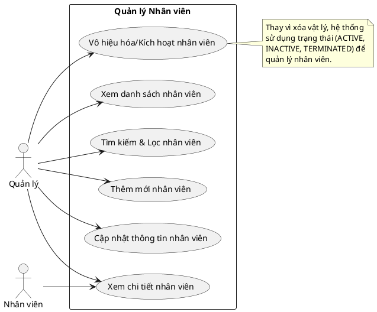

# Biểu đồ Use Case - Quản lý Nhân viên (Employee CRUD)

Dưới đây là biểu đồ Use Case mô tả các tác vụ CRUD và quản lý thông tin **Nhân viên (Employee)** trong hệ thống.

```plantuml
@startuml
left to right direction
skinparam packageStyle rectangle

actor "Quản lý" as Manager
actor "Nhân viên" as Staff

package "Quản lý Nhân viên" {
    usecase "Xem danh sách nhân viên" as UC_List
    usecase "Xem chi tiết nhân viên" as UC_Detail
    usecase "Tìm kiếm & Lọc nhân viên" as UC_Search
    usecase "Thêm mới nhân viên" as UC_Create
    usecase "Cập nhật thông tin nhân viên" as UC_Update
    usecase "Vô hiệu hóa/Kích hoạt nhân viên" as UC_Status
}

' Nhân viên có thể xem thông tin cá nhân hoặc chi tiết nhân viên khác (theo logic code)
Staff --> UC_Detail

' Quản lý có toàn quyền quản lý nhân viên
Manager --> UC_List
Manager --> UC_Detail
Manager --> UC_Search
Manager --> UC_Create
Manager --> UC_Update
Manager --> UC_Status

note Right of UC_Status
  Thay vì xóa vật lý, hệ thống
  sử dụng trạng thái (ACTIVE,
  INACTIVE, TERMINATED) để
  quản lý nhân viên.
end note

@enduml
```
