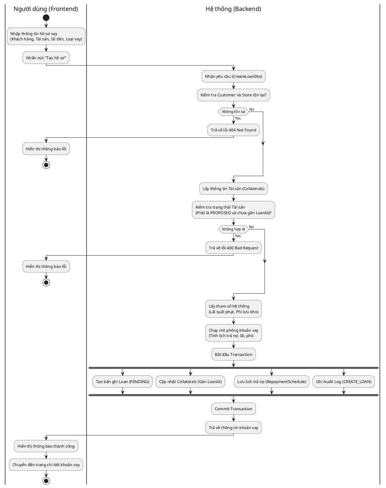
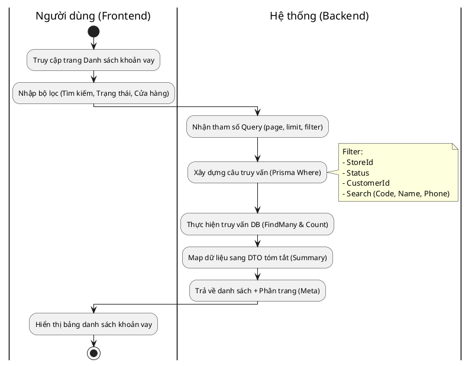
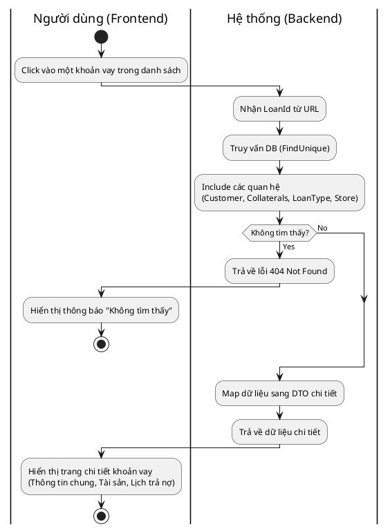
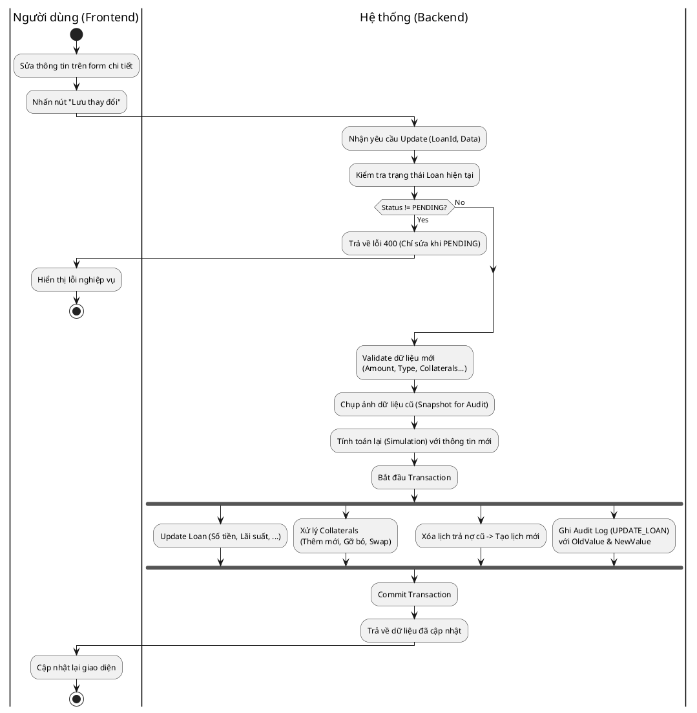
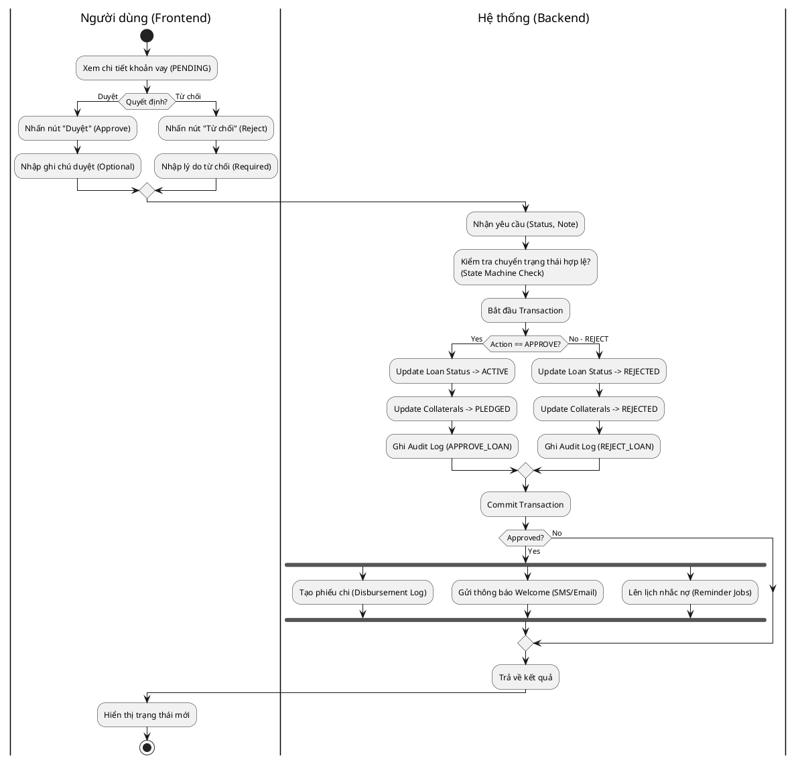
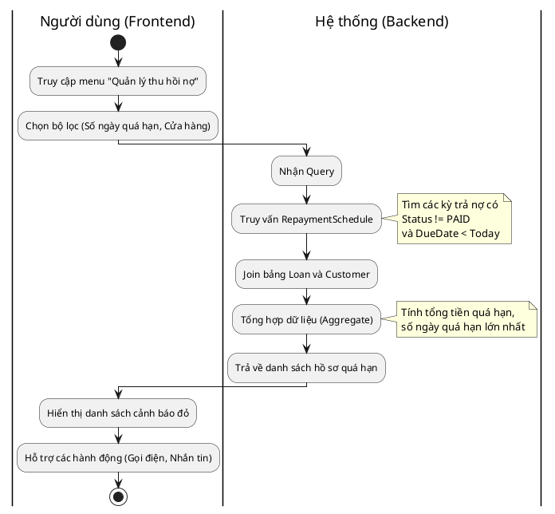

# Biểu đồ Hoạt động - Quản lý Khoản vay (Loan Activity Diagrams)

Tài liệu này mô tả chi tiết luồng hoạt động (Activity Flow) cho các chức năng quản lý khoản vay, từ thao tác người dùng (Frontend) đến xử lý hệ thống (Backend).

## 1. Tạo hồ sơ vay mới (Create Loan)

**Giải thích luồng xử lý:**
1.  **Người dùng** nhập các thông tin cần thiết: chọn Khách hàng, chọn Tài sản (đang ở trạng thái Chờ định giá/Đề xuất), nhập số tiền vay và chọn sản phẩm vay (Loan Type).
2.  **Backend** xác thực dữ liệu:
    *   Đảm bảo Khách hàng và Cửa hàng tồn tại.
    *   Đảm bảo các Tài sản được chọn đang ở trạng thái `PROPOSED` và chưa thuộc về hợp đồng nào khác.
3.  **Hệ thống** tự động tính toán (Mô phỏng):
    *   Lấy các tham số cấu hình (Lãi phạt, phí lưu kho từ loại tài sản).
    *   Tính toán lịch trả nợ dự kiến (Gốc, Lãi, Phí) dựa trên số tiền và thời hạn.
4.  **Lưu trữ (Transaction):**
    *   Tạo bản ghi `Loan` với trạng thái `PENDING`.
    *   Cập nhật `Collateral` để liên kết với Loan vừa tạo.
    *   Lưu chi tiết lịch trả nợ vào bảng `RepaymentScheduleDetail`.
    *   Ghi nhật ký hệ thống (`AuditLog`).
5.  **Kết quả:** Trả về đối tượng Loan đầy đủ để Frontend hiển thị.

---

## 2. Xem danh sách khoản vay (List Loans)

**Giải thích luồng xử lý:**
1.  **Người dùng** vào trang danh sách, có thể tìm kiếm theo tên khách, số điện thoại, mã hợp đồng hoặc lọc theo trạng thái (Ví dụ: Chỉ xem hồ sơ Chờ duyệt).
2.  **Backend** tiếp nhận tham số phân trang (`page`, `limit`) và các điều kiện lọc.
3.  **Hệ thống** xây dựng câu lệnh truy vấn động (Dynamic Query) để tìm các bản ghi thỏa mãn trong Database.
4.  **Kết quả:** Trả về danh sách các khoản vay dưới dạng tóm tắt (chỉ các trường quan trọng) kèm thông tin phân trang (Tổng số trang, trang hiện tại) để Frontend hiển thị lưới dữ liệu (Grid/Table).

---

## 3. Xem chi tiết khoản vay (View Loan Details)

**Giải thích luồng xử lý:**
1.  **Người dùng** chọn xem chi tiết một hồ sơ.
2.  **Backend** tìm kiếm khoản vay theo ID.
3.  **Hệ thống** lấy kèm (Join) các thông tin liên quan:
    *   Thông tin khách hàng chi tiết.
    *   Danh sách tài sản cầm cố.
    *   Loại hình vay (Lãi suất, thời hạn).
4.  **Kết quả:** Trả về toàn bộ thông tin để Frontend hiển thị form chi tiết, cho phép người dùng xem lại kỹ lưỡng trước khi duyệt hoặc sửa đổi.

---

## 4. Cập nhật thông tin khoản vay (Update Loan - Pending only)

**Giải thích luồng xử lý:**
1.  **Người dùng** thay đổi thông tin hồ sơ (ví dụ: Giảm số tiền vay, đổi tài sản khác) khi hồ sơ chưa được duyệt.
2.  **Backend** kiểm tra chặt chẽ: Chỉ cho phép sửa khi trạng thái là `PENDING`.
3.  **Hệ thống** thực hiện tính toán lại toàn bộ:
    *   Nếu đổi tài sản: Kiểm tra tài sản mới có hợp lệ không.
    *   Nếu đổi số tiền/kỳ hạn: Tính lại lịch trả nợ.
4.  **Lưu trữ (Transaction):**
    *   Cập nhật bảng Loan.
    *   Cập nhật liên kết Tài sản (Gỡ tài sản cũ trả về trạng thái PROPOSED, gán tài sản mới).
    *   **Quan trọng:** Xóa lịch trả nợ cũ và tạo lại lịch trả nợ mới khớp với thay đổi.
    *   Ghi Audit Log chi tiết sự thay đổi (Trước/Sau).

---

## 5. Duyệt / Từ chối khoản vay (Approve/Reject Loan)

**Giải thích luồng xử lý:**
1.  **Quản lý** xem xét hồ sơ và đưa ra quyết định.
2.  **Backend** kiểm tra tính hợp lệ của việc chuyển trạng thái (chỉ PENDING mới được Approve/Reject).
3.  **Xử lý Transaction:**
    *   **Duyệt:** Chuyển trạng thái Loan sang `ACTIVE`, Tài sản sang `PLEDGED` (Đang cầm cố).
    *   **Từ chối:** Chuyển trạng thái Loan sang `REJECTED`, Tài sản sang `REJECTED` (hoặc trả lại tùy nghiệp vụ, ở đây set REJECTED theo code).
    *   Ghi Audit Log người duyệt và thời gian duyệt.
4.  **Hậu xử lý (Sau khi Commit):**
    *   Tự động tạo phiếu chi tiền (Disbursement) mặc định là Tiền mặt (Cash) để kế toán xử lý.
    *   Gửi tin nhắn/email thông báo cho khách hàng.
    *   Kích hoạt các tác vụ nền (Background Jobs) để nhắc nợ tự động trong tương lai.

---

## 6. Xem danh sách nợ quá hạn (List Overdue Loans)

**Giải thích luồng xử lý:**
1.  **Nhân viên thu hồi nợ** truy cập chức năng để xem danh sách khách hàng đang trễ hạn.
2.  **Backend** quét bảng lịch trả nợ (`RepaymentScheduleDetail`):
    *   Lọc các bản ghi chưa thanh toán (`PENDING`/`PARTIAL`) và có ngày đến hạn (`DueDate`) nhỏ hơn ngày hiện tại.
3.  **Hệ thống** tổng hợp dữ liệu:
    *   Nhóm theo Khoản vay/Khách hàng.
    *   Tính toán tổng số tiền phạt và số ngày quá hạn.
4.  **Kết quả:** Trả về danh sách ưu tiên để nhân viên thực hiện các biện pháp nhắc nợ (Gọi điện, gửi SMS).
