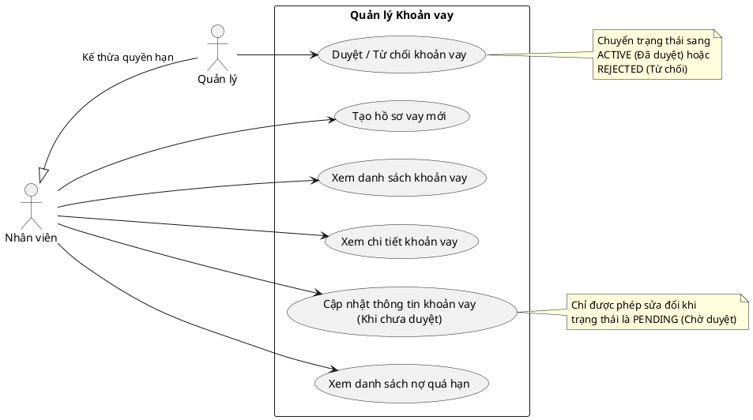

# Biểu đồ Use Case - Quản lý Khoản vay (Loan CRUD)

Dưới đây là biểu đồ Use Case mô tả các tác vụ CRUD và quy trình nghiệp vụ cơ bản liên quan đến **Khoản vay (Loan)** trong hệ thống, dựa trên API hiện có.

