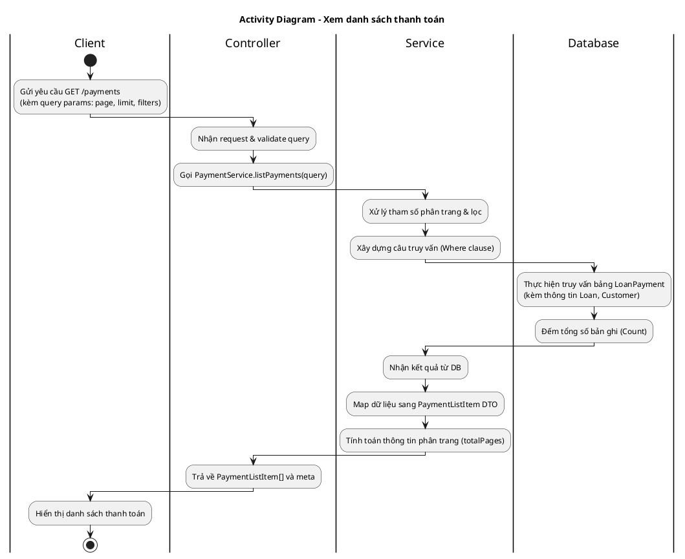
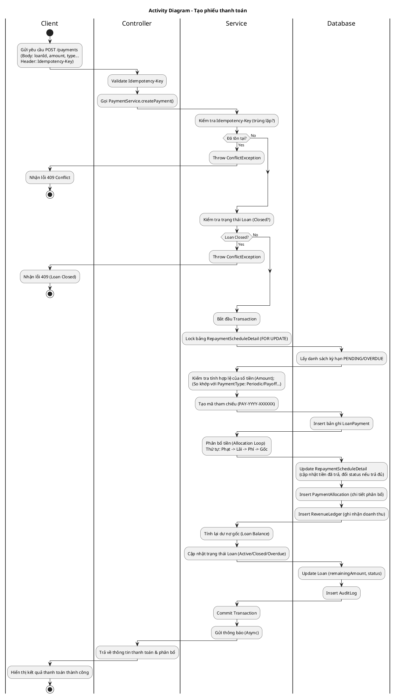
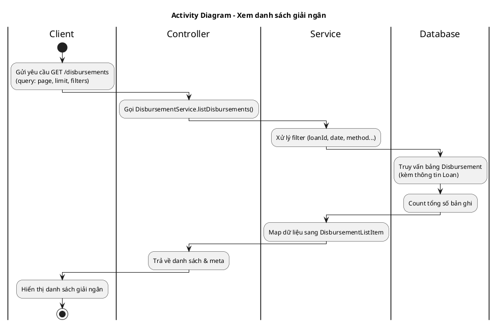
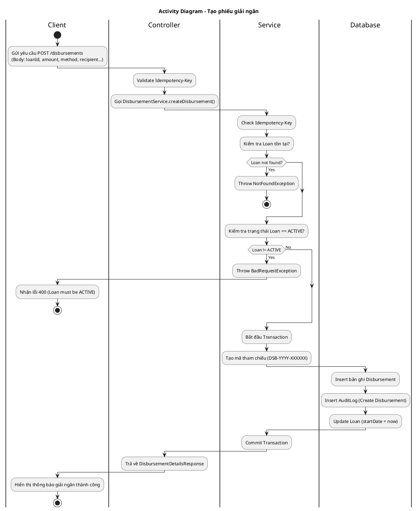

# Sơ đồ Hoạt động - Quản lý Thanh toán và Giải ngân

Tài liệu này cung cấp các biểu đồ hoạt động (Activity Diagrams) cho 4 tác vụ chính trong module Thanh toán và Giải ngân. Các luồng đi từ Client (Người dùng/Frontend) đến Database và trả về kết quả.

## 1. Xem danh sách thanh toán (View Payments)

Quy trình hiển thị danh sách các khoản thanh toán đã thực hiện, hỗ trợ phân trang và lọc theo nhiều tiêu chí (khoản vay, ngày tháng, số tiền...). 

### Giải thích luồng
1.  **Client**: Gửi request lấy danh sách thanh toán với các bộ lọc (ngày, mã hợp đồng, số tiền...).
2.  **Controller**: Nhận request, kiểm tra quyền hạn (Manager/Staff) và gọi Service.
3.  **Service**:
    *   Chuẩn hóa các tham số lọc và phân trang.
    *   Truy vấn Database lấy danh sách `LoanPayment` khớp điều kiện, sắp xếp theo thời gian hoặc tiêu chí được chọn.
    *   Đếm tổng số bản ghi để tính số trang.
4.  **Database**: Trả về dữ liệu thô.
5.  **Service**: Chuyển đổi dữ liệu thô sang format chuẩn (`PaymentListItem`) để ẩn các thông tin không cần thiết.
6.  **Client**: Nhận kết quả và hiển thị bảng dữ liệu.

---

## 2. Tạo phiếu thanh toán (Create Payment)

Quy trình ghi nhận một khoản thanh toán mới cho hợp đồng vay. Hệ thống tự động phân bổ tiền vào các khoản nợ (Lãi, Phí, Phạt, Gốc) theo quy tắc dòng tiền (waterfall).

### Giải thích luồng
1.  **Client**: Gửi thông tin thanh toán (Số tiền, Loại thanh toán: Kỳ/Tất toán/Trả trước...) kèm `Idempotency-Key` để tránh double-submit.
2.  **Controller**: Chuyển yêu cầu xuống Service.
3.  **Service**:
    *   Kiểm tra tính duy nhất của `Idempotency-Key`.
    *   Kiểm tra hợp đồng vay có tồn tại và chưa đóng hay không.
    *   **Transaction**: Bắt đầu giao dịch DB để đảm bảo toàn vẹn dữ liệu.
    *   **Locking**: Khóa các dòng lịch trả nợ để tránh xung đột nếu có thanh toán đồng thời.
    *   **Validation**: Kiểm tra số tiền có hợp lệ với loại thanh toán không (VD: Tất toán phải trả chính xác số dư nợ).
    *   **Allocation**: Phân bổ số tiền nhận được vào các thành phần nợ theo thứ tự ưu tiên: **Phạt quá hạn -> Lãi -> Phí dịch vụ -> Gốc**.
    *   **Persist**: Lưu thông tin thanh toán (`LoanPayment`), chi tiết phân bổ (`PaymentAllocation`), và cập nhật lịch trả nợ (`RepaymentScheduleDetail`).
    *   **Accounting**: Ghi nhận doanh thu vào sổ cái (`RevenueLedger`).
    *   **Update Loan**: Tính toán lại dư nợ còn lại, cập nhật trạng thái hợp đồng (Đóng hợp đồng nếu trả hết).
    *   **Audit**: Ghi nhật ký hệ thống.
4.  **Client**: Nhận kết quả chi tiết về việc số tiền đã được phân bổ như thế nào.

---

## 3. Xem danh sách giải ngân (View Disbursements)

Quy trình xem lịch sử các khoản giải ngân đã thực hiện.

### Giải thích luồng
1.  **Client**: Gửi request xem danh sách giải ngân.
2.  **Service**:
    *   Xây dựng câu query dựa trên bộ lọc.
    *   Lấy dữ liệu từ bảng `Disbursement`, join với bảng `Loan` để lấy mã hợp đồng.
3.  **Client**: Nhận danh sách để hiển thị, bao gồm thông tin: Mã phiếu, Số tiền, Người nhận, Hình thức giải ngân (Tiền mặt/Chuyển khoản).

---

## 4. Tạo phiếu giải ngân (Create Disbursement)

Quy trình chi tiền cho khách hàng sau khi hợp đồng vay được duyệt và kích hoạt. Chỉ Manager mới có quyền thực hiện.

### Giải thích luồng
1.  **Client**: Gửi thông tin giải ngân (Số tiền, Hình thức, Thông tin người nhận, Ngân hàng...). 
2.  **Controller**: Xác thực quyền (Manager only) và gọi Service.
3.  **Service**:
    *   Kiểm tra `Idempotency-Key`.
    *   Kiểm tra hợp đồng vay: Phải tồn tại và đang ở trạng thái **ACTIVE**. (Lưu ý: Hệ thống yêu cầu hợp đồng đã Active mới cho phép ghi nhận giải ngân).
    *   **Transaction**:
        *   Tạo mã phiếu giải ngân tự động.
        *   Lưu bản ghi `Disbursement` vào Database.
        *   Ghi Audit Log.
        *   Cập nhật ngày bắt đầu (`startDate`) của hợp đồng vay bằng thời điểm giải ngân thực tế.
4.  **Client**: Nhận kết quả giải ngân thành công.
