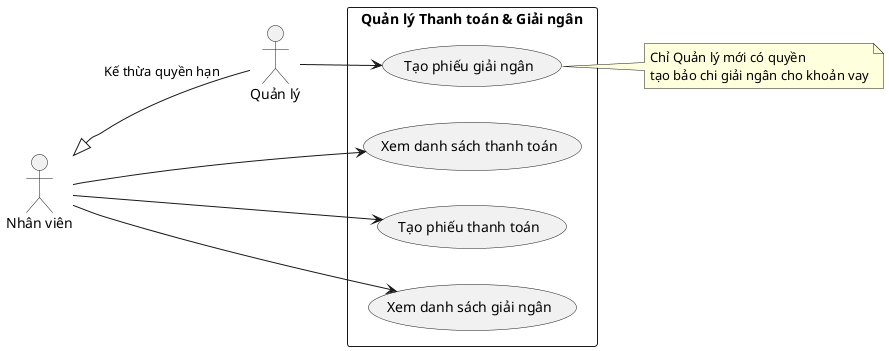

# Biểu đồ Use Case - Quản lý Thanh toán và Giải ngân (Payment & Disbursement)

Dưới đây là biểu đồ Use Case mô tả các tác vụ và quy trình nghiệp vụ liên quan đến **Thanh toán (Payment)** và **Giải ngân (Disbursement)** trong hệ thống, dựa trên API hiện có.

