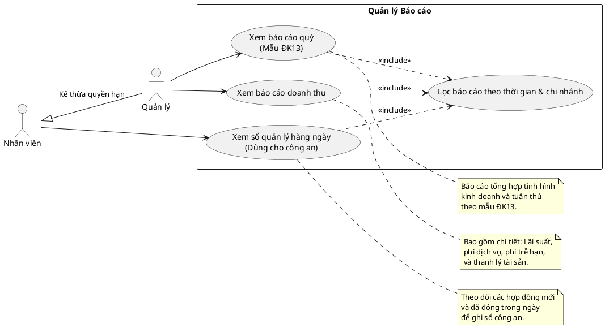

# Biểu đồ Use Case - Quản lý Báo cáo (Report Actions)

Dưới đây là biểu đồ Use Case mô tả các tác vụ và quy trình nghiệp vụ liên quan đến **Báo cáo (Reports)** trong hệ thống, dựa trên API hiện có.

