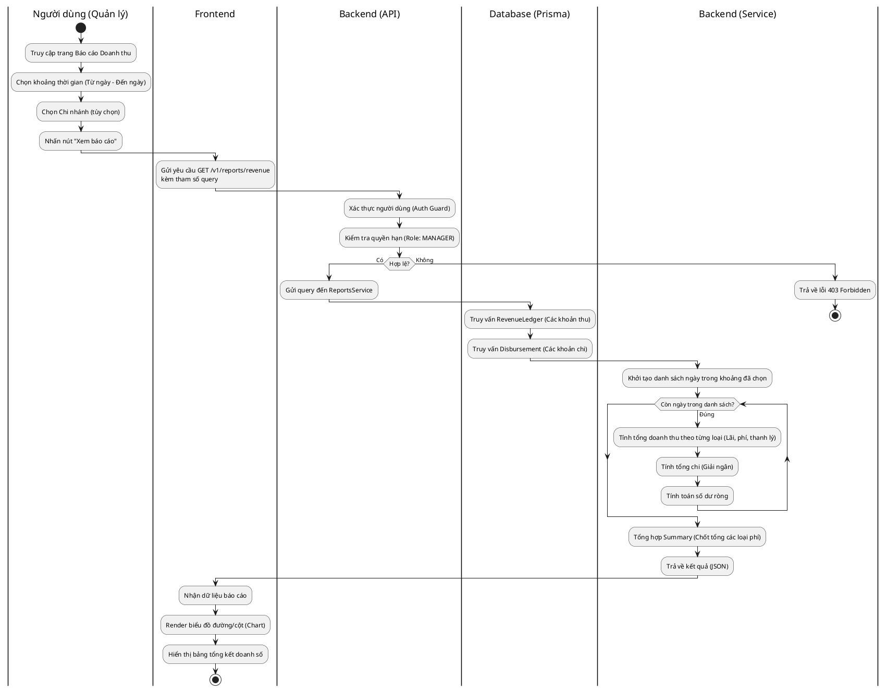
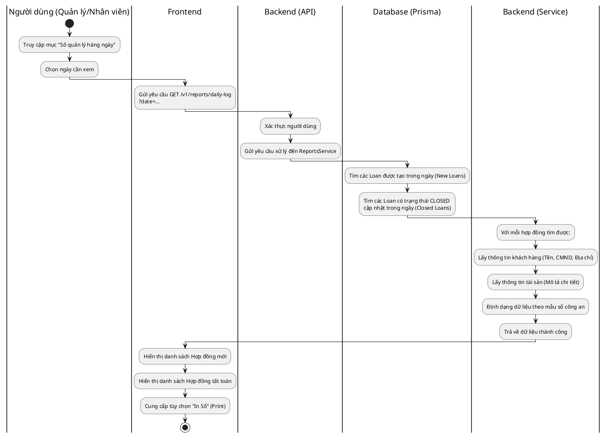
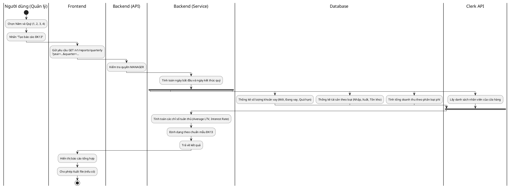

# Biểu đồ Hoạt động cho các chức năng Báo cáo (Report Activity Diagrams)

Tài liệu này chi tiết hóa quy trình từ đầu đến cuối (End-to-End) cho các hoạt động báo cáo trong hệ thống.

---

## 1. Quy trình Xem Báo cáo Doanh thu (Revenue Report)

### Biểu đồ Hoạt động

### Giải thích quy trình

1. **Khởi tạo:** Người quản lý chọn phạm vi thời gian và chi nhánh muốn xem.
2. **Giao tiếp:** Frontend gọi API backend. Backend thực hiện xác thực xem có phải là Quản lý hay không (nhân viên không được xem doanh thu).
3. **Xử lý dữ liệu:**
   - Hệ thống thực hiện truy vấn đồng thời vào bảng `RevenueLedger` (ghi nhận lãi, phí dịch vụ, phí trễ hạn) và bảng `Disbursement` (ghi nhận tiền giải ngân ra).
   - Sau đó, logic tại Service sẽ "quét" qua từng ngày trong khoảng thời gian để phân loại và cộng dồn tiền.
4. **Kết quả:** Dữ liệu trả về được Frontend trực quan hóa bằng các biểu đồ giúp quản lý dễ dàng so sánh giữa doanh thu và chi phí giải ngân.

---

## 2. Quy trình Xem Sổ quản lý hàng ngày (Daily Log)

### Biểu đồ Hoạt động

### Giải thích quy trình

1. **Mục đích:** Cung cấp dữ liệu để cơ sở kinh doanh ghi chép vào sổ quản lý do công an cấp.
2. **Truy vấn:** Backend tập trung vào hai nhóm dữ liệu chính trong ngày được chọn:
   - **Hợp đồng mới:** Những hợp đồng bắt đầu giải ngân.
   - **Hợp đồng đã đóng:** Những hợp đồng khách đã chuộc đồ hoặc đã hoàn tất nghĩa vụ.
3. **Chi tiết khách hàng:** Khác với báo cáo doanh thu, quy trình này yêu cầu lấy thông tin định danh cá nhân (PII) như CMND/CCCD và địa chỉ để phục vụ mục đích khai báo lưu trú/kinh doanh đặc thù.

---

## 3. Quy trình Xem Báo cáo Quý (Mẫu ĐK13)

### Biểu đồ Hoạt động

### Giải thích quy trình

1. **Tính chất:** Đây là quy trình báo cáo phức tạp nhất, tổng hợp dữ liệu từ nhiều nguồn.
2. **Xử lý song song:** Để tối ưu tốc độ, Backend thực hiện nhiều truy vấn cùng lúc (fork):
   - Đếm số lượng hợp đồng vay theo trạng thái.
   - Tổng hợp tài sản thế chấp theo từng nhóm (Điện thoại, Xe máy, Trang sức...).
   - Tính toán doanh thu thô.
   - Gọi API bên thứ 3 (Clerk) để lấy số lượng nhân sự.
3. **Phân tích:** Service tính toán thêm các chỉ số như tỷ lệ cho vay trên giá trị tài sản (LTV) trung bình và lãi suất bình quân để đảm bảo cửa hàng hoạt động trong khung quy định của pháp luật.
4. **Đầu ra:** Frontend trình bày dữ liệu này theo đúng định dạng mẫu biểu của cơ quan chức năng (ĐK13).
