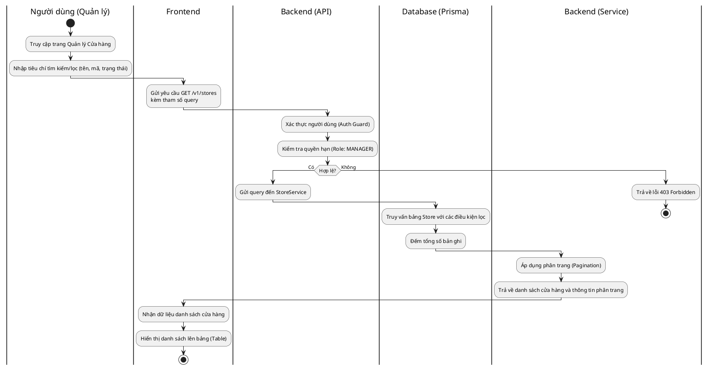
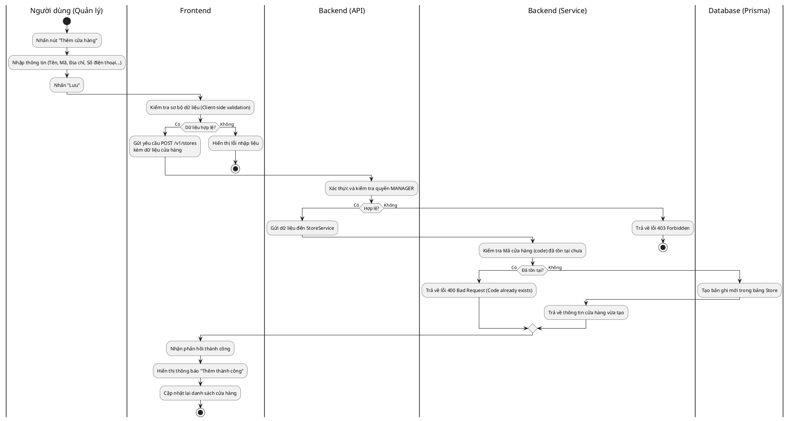
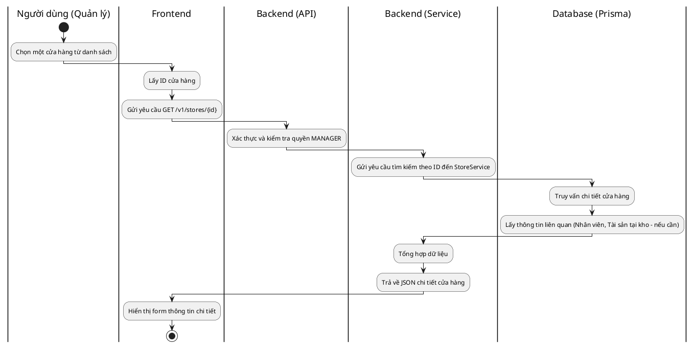
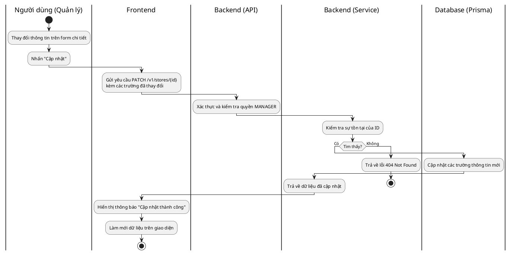

# Biểu đồ Hoạt động cho Quản lý Cửa hàng (Store Activity Diagrams)

Tài liệu này chi tiết hóa quy trình từ đầu đến cuối (End-to-End) cho các hoạt động quản lý **Cửa hàng (Store)** trong hệ thống, bao gồm các tương tác từ người dùng, giao diện (Frontend) đến máy chủ (Backend) và cơ sở dữ liệu (Database).

---

## 1. Quy trình Xem danh sách cửa hàng (View Store List)

### Biểu đồ Hoạt động

### Giải thích quy trình

1. **Khởi tạo:** Người quản lý truy cập vào mục cấu hình hệ thống hoặc quản lý chi nhánh.
2. **Giao tiếp:** Frontend gọi API backend với các tham số như từ khóa tìm kiếm hoặc trang hiện tại. Backend kiểm tra xem người dùng có phải là Quản lý hay không.
3. **Truy vấn:** Hệ thống tìm kiếm trong bảng `Store` dựa trên các điều kiện lọc. Kết quả được phân trang để đảm bảo hiệu năng khi số lượng cửa hàng lớn.
4. **Kết quả:** Danh sách các cửa hàng (bao gồm tên, địa chỉ, mã cửa hàng) được hiển thị cho người dùng.

---

## 2. Quy trình Thêm mới cửa hàng (Create Store)

### Biểu đồ Hoạt động

### Giải thích quy trình

1. **Nhập liệu:** Người quản lý điền các thông tin bắt buộc của một chi nhánh mới.
2. **Kiểm tra:**
   - **Frontend:** Kiểm tra các trường không được để trống, định dạng số điện thoại.
   - **Backend:** Kiểm tra tính duy nhất của Mã cửa hàng (Code) để tránh trùng lặp trong hệ thống.
3. **Lưu trữ:** Sau khi vượt qua tất cả các lớp kiểm tra, một bản ghi mới được tạo trong cơ sở dữ liệu.
4. **Phản hồi:** Hệ thống thông báo kết quả và làm mới danh sách hiển thị để người dùng thấy ngay cửa hàng vừa thêm.

---

## 3. Quy trình Xem chi tiết cửa hàng (View Store Detail)

### Biểu đồ Hoạt động

### Giải thích quy trình

1. **Khởi tạo:** Người dùng muốn xem thông tin kỹ hơn hoặc chuẩn bị chỉnh sửa một cửa hàng cụ thể.
2. **Truy vấn:** Backend tìm kiếm bản ghi trong database bằng khóa chính (ID).
3. **Kết quả:** Trả về toàn bộ thuộc tính của cửa hàng để điền vào form hiển thị ở Frontend.

---

## 4. Quy trình Cập nhật thông tin cửa hàng (Update Store)

### Biểu đồ Hoạt động

### Giải thích quy trình

1. **Chỉnh sửa:** Người dùng sửa đổi các thông tin như địa chỉ hoặc số điện thoại liên lạc của chi nhánh.
2. **Giao tiếp:** Frontend chỉ gửi các trường dữ liệu bị thay đổi (Partial Update) thông qua phương thức PATCH.
3. **Thực thi:** Backend thực hiện câu lệnh `update` trong Prisma.
4. **Kết thúc:** Giao diện người dùng được cập nhật để phản ánh những thay đổi mới nhất.
