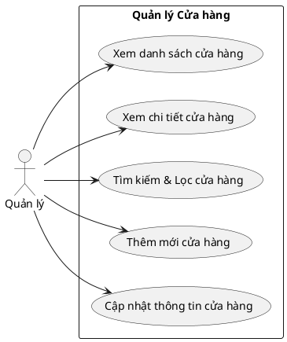

# Biểu đồ Use Case - Quản lý Cửa hàng (Store CRUD)

Dưới đây là biểu đồ Use Case mô tả các tác vụ CRUD và quản lý thông tin **Cửa hàng (Store)** trong hệ thống.

```plantuml
@startuml
left to right direction
skinparam packageStyle rectangle

actor "Quản lý" as Manager

package "Quản lý Cửa hàng" {
    usecase "Xem danh sách cửa hàng" as UC_List
    usecase "Xem chi tiết cửa hàng" as UC_Detail
    usecase "Tìm kiếm & Lọc cửa hàng" as UC_Search
    usecase "Thêm mới cửa hàng" as UC_Create
    usecase "Cập nhật thông tin cửa hàng" as UC_Update
}

' Quản lý có quyền thực hiện các thao tác quản lý cửa hàng
Manager --> UC_List
Manager --> UC_Detail
Manager --> UC_Search
Manager --> UC_Create
Manager --> UC_Update

@enduml
```
