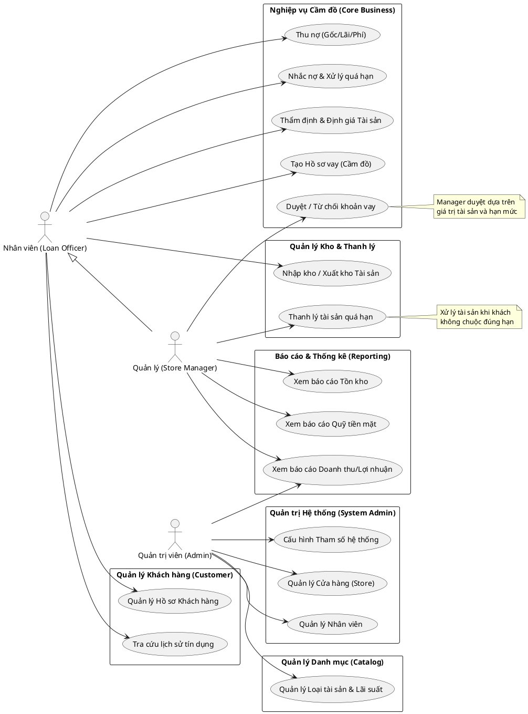

# Biểu đồ Use Case Tổng quan Hệ thống (High-Level System Overview)

Biểu đồ dưới đây cung cấp cái nhìn toàn cảnh về phạm vi chức năng của hệ thống Quản lý Cầm đồ (Pawn Manager), phân chia theo các phân hệ nghiệp vụ chính và các tác nhân tương tác.

## Giải thích các tác nhân (Actors):

1.  **Nhân viên (Loan Officer/Clerk):**
    - Là người trực tiếp giao dịch với khách hàng tại cửa hàng.
    - Nhiệm vụ chính: Tạo hồ sơ khách hàng, thẩm định sơ bộ tài sản, tạo hợp đồng vay, thu tiền lãi/gốc định kỳ, và quản lý việc cất giữ/trả lại tài sản trong kho.

2.  **Quản lý (Store Manager):**
    - Chịu trách nhiệm về hoạt động của một cửa hàng cụ thể.
    - Có toàn quyền của Nhân viên, cộng thêm quyền phê duyệt các khoản vay (đặc biệt các khoản giá trị lớn), quyết định thanh lý tài sản quá hạn, và xem các báo cáo tài chính chi tiết của cửa hàng.

3.  **Quản trị viên (Admin):**
    - Người quản lý cấu hình toàn hệ thống.
    - Nhiệm vụ chính: Thiết lập danh sách cửa hàng, tạo tài khoản cho nhân viên/quản lý, cấu hình các loại tài sản (tỷ lệ định giá, lãi suất khung), và xem báo cáo tổng hợp toàn chuỗi.

## Các phân hệ chính:

- **Quản trị hệ thống & Danh mục:** Nơi thiết lập nền tảng dữ liệu (Cửa hàng, Loại tài sản, Nhân sự).
- **Nghiệp vụ Cầm đồ:** Luồng chính của phần mềm từ lúc khách đến vay, thẩm định, tạo hợp đồng cho đến khi thanh toán.
- **Quản lý Kho & Thanh lý:** Quản lý vòng đời vật lý của tài sản cầm cố.
- **Báo cáo:** Cung cấp số liệu ra quyết định cho quản lý.
